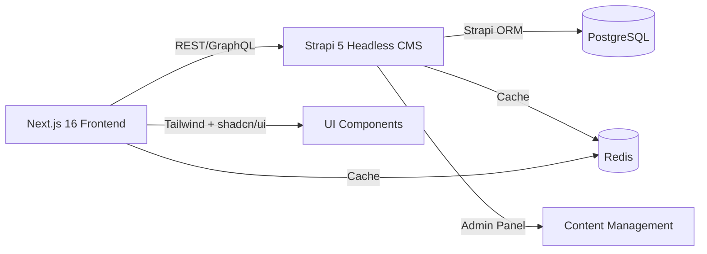

# Project Skills & Agents Guide

## 📚 Available Skills
**Always respond in Russian (Русский язык). All communication with the developer must be in Russian.**
This project uses specialized skills to optimize development across different domains:


### 1. **Next.js & React** (`skills/next-js-react.md`)
**Use when:**
- Building new pages or components
- Setting up data fetching (Server/Client Components)
- Optimizing performance (Code splitting, memoization)
- Creating responsive layouts with Tailwind

**Key concepts:**
- App Router architecture
- Server Components by default
- useCallback, useMemo optimization
- Dynamic imports for code splitting
<!-- BEGIN:nextjs-agent-rules -->
# This is NOT the Next.js you know

This version has breaking changes — APIs, conventions, and file structure may all differ from your training data. Read the relevant guide in `node_modules/next/dist/docs/` before writing any code. Heed deprecation notices.
<!-- END:nextjs-agent-rules -->

---

### 2. **Strapi 5 Backend** (`skills/strapi-backend.md`)
**Use when:**
- Creating content types and components
- Configuring Strapi admin panel
- Setting up API endpoints (auto-generated)
- Implementing authentication/authorization (users-permissions plugin)
- Creating custom plugins or middleware

**Key concepts:**
- Content types (Collection types, Single types)
- Components and Dynamic zones
- Lifecycle hooks (beforeCreate, afterUpdate, etc.)
- Strapi ORM (built-in database layer)
- Plugins system (users-permissions, upload, i18n)
- Admin panel customization

---

### 3. **API Integration** (`skills/api-integration.md`)
**Use when:**
- Setting up frontend-backend communication
- Creating typed API clients
- Managing authentication tokens
- Implementing error handling and retries
- Adding pagination and filtering

**Key concepts:**
- Strongly typed API clients
- Shared type definitions
- Error boundaries
- Retry logic
- Token management

---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

### 4. **PostgreSQL & Strapi ORM** (`skills/strapi-database.md`)
**Use when:**
- Designing content types (Strapi auto-generates database schema)
- Creating or modifying database relations
- Setting up Strapi migrations
- Handling media files (upload plugin)

**Key concepts:**
- Strapi auto-generated database schema
- Relations (One-to-Many, Many-to-Many via Strapi)
- Lifecycle hooks for data manipulation
- Strapi migrations vs manual migrations
- Media handling (upload plugin)

---

### 5. **Redis Caching** (`skills/redis-caching.md`)
**Use when:**
- Implementing query result caching
- Managing user sessions
- Rate limiting
- Real-time features with Pub/Sub
- Building leaderboards or activity feeds

**Key concepts:**
- Cache invalidation strategies
- Session management
- Token bucket rate limiting
- Redis Pub/Sub for events
- Sorted sets and hashes

---

### 6. **Tailwind CSS + shadcn/ui** (`skills/shadcn-ui.md`)
**Use when:**
- Creating new UI components
- Building accessible component libraries
- Styling with Tailwind CSS utilities
- Creating form components
- Implementing responsive designs

**Key concepts:**
- shadcn/ui CLI for adding components
- Components copied locally (not npm package)
- Built on Radix UI primitives
- Tailwind utility-first approach
- CVA (Class Variance Authority) for component variants
- Dark mode support

---

## 🏗️ Project Architecture

```
Next.js 16 (Frontend) ←→ Strapi 5 (Headless CMS)
  ↓                          ↓
Tailwind + shadcn/ui    Strapi ORM + PostgreSQL
  ↓                          ↓
  API Client              REST/GraphQL API
  ↓                          ↓
  Cache (Redis)         Strapi Cache (Redis)
```



## 🚀 Common Workflows

### Creating a New Feature
1. **Design Content Type** (Strapi Backend skill)
   - Create content type in Strapi admin or via code
   - Define fields and relations
   - Configure permissions

2. **Set up database** (Strapi Database skill)
   - Strapi auto-generates schema
   - Add lifecycle hooks if needed
   - Configure media handling

3. **Add caching layer** (Redis skill)
   - Cache expensive queries
   - Implement cache invalidation

4. **Build UI components** (Tailwind + shadcn/ui skill)
   - Use shadcn/ui CLI to add components
   - Customize with Tailwind
   - Ensure accessibility

5. **Integrate frontend** (React + API Integration skills)
   - Create API client for Strapi
   - Handle loading/error states
   - Add error boundaries

### Example: Add "Likes" Feature
```
Backend:
  1. Create Like content type (Strapi Database skill)
  2. Configure permissions (Strapi Backend skill)
  3. Add cache for like counts (Redis skill)

Frontend:
  1. Create LikeButton component (Tailwind + shadcn/ui)
  2. Add API integration (API Integration skill)
  3. Handle optimistic updates
  4. Cache like counts locally
```

## 📝 Style Consistency

### Code Organization
- Frontend: `apps/frontend/` (Next.js App Router)
- Backend: `apps/backend/` (Strapi 5 project)
- Shared: `packages/types/` (TypeScript interfaces)

### Naming Conventions
- **Files**: kebab-case (`user-form.tsx`)
- **Components**: PascalCase (`UserForm`)
- **Functions**: camelCase (`handleSubmit()`)
- **Constants**: UPPER_SNAKE_CASE (`API_BASE_URL`)
- **Database columns**: snake_case (`created_at`)

### File Structure by Type
- **Components**: `/components/[domain]/[component-name].tsx` (Next.js)
- **Hooks**: `/hooks/[use-hook-name].ts`
- **Utils**: `/lib/[utility-name].ts`
- **Services**: `services/[domain].service.ts` (API clients)
- **Content Types**: `apps/backend/src/api/[content-type]/` (Strapi)

## 🧪 Testing Patterns

Reference the appropriate skill for testing patterns:
- **Frontend**: Use React Testing Library + Jest
- **Backend**: Use Jest with mocks
- **Database**: Use test fixtures
- **Integration**: Use E2E tests

## 📊 Performance Checklist

- [ ] Database queries optimized (no N+1)
- [ ] Result caching implemented (Redis)
- [ ] Frontend code split by route
- [ ] Images optimized with Next.js Image
- [ ] API responses paginated
- [ ] Rate limiting in place
- [ ] Error logs centralized

## 🔒 Security Checklist

- [ ] Input validation on frontend & backend
- [ ] CSRF protection
- [ ] Secure session management
- [ ] SQL injection prevention (Strapi ORM parameterized queries)
- [ ] XSS prevention
- [ ] Rate limiting enabled
- [ ] HTTPS in production
- [ ] Secrets in environment variables

## 🔗 Quick Reference

| Task | Skill | Example |
|------|-------|---------|
| New page | Next.js React | Server component with data fetch |
| New API | Strapi Backend | Content type + auto-generated endpoints |
| Database | Strapi Database | Content type + Relations |
| Cache | Redis | Query caching with TTL |
| UI | Tailwind shadcn/ui | Button variants, Dialog, DropdownMenu |
| Integration | API Integration | Typed client + error handling |

---

**Last Updated**: April 2026
**Stack**: Next.js 16 + Strapi 5 + Strapi ORM + Redis + PostgreSQL + Tailwind + shadcn/ui
