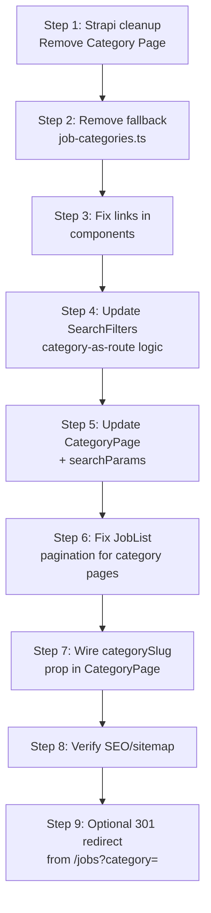
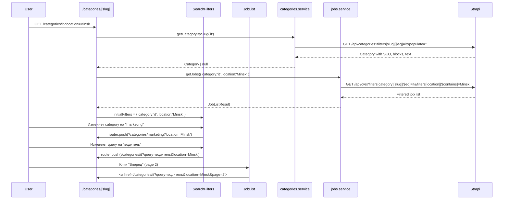

# Рефакторинг фильтра категорий: Strapi-коллекция + полноценные страницы

## Резюме

Переход от `/jobs?category=X` к `/categories/X` как каноническим страницам категорий. Категории берутся исключительно из Strapi (коллекция `Category`), хардкодный fallback удаляется. Страницы категорий поддерживают дополнительные searchParams (location, type, query, page). Смена категории в фильтре на странице категории изменяет route, а не searchParam.

---

## Текущие проблемы

| Проблема | Локация | Описание |
|----------|---------|----------|
| Дублирование Strapi коллекций | `Category` + `Category Page` | Обе имеют SEO, blocks, text. Category Page — артефакт. |
| Хардкодный fallback | `app/data/job-categories.ts` | 6 категорий, не синхронизированы со Strapi |
| Неверные ссылки | `category-catalog.tsx`, `professions-section.tsx` | Ведут на `/jobs?category=X` вместо `/categories/X` |
| Нет searchParams на странице категории | `app/categories/[category]/page.tsx` | Доп. фильтры (query, location, type, page) игнорируются |
| Пагинация на странице категории | `JobList` → `pageHref()` | Генерирует `/categories?category=X&page=N` вместо `/categories/X?page=N` |
| Кнопка сброса категории | `JobList` строка 60 | Ведёт на `/categories#vacancies` — бессмысленно |
| Поисковый фильтр на странице категории | `SearchFilters` | Добавляет category как searchParam, но категория уже в route |

---

## Архитектура решения

```mermaid
flowchart TD
    subgraph Strapi
        Cat[Category Collection]
        CatSEO[SEO Component]
        CatBlocks[Dynamic Zone: blocks]
        CatText[richtext: text]
        Cat --> CatSEO
        Cat --> CatBlocks
        Cat --> CatText
    end

    subgraph Frontend_Services
        CS[categories.service.ts]
        JS[jobs.service.ts]
        CS -->|GET /api/categories| Cat
        JS -->|GET /api/cvs| Strapi
    end

    subgraph Pages
        CP[/categories/page.tsx<br>Listing all]
        CGP[/categories/[slug]/page.tsx<br>Category detail + jobs]
        JP[/jobs/page.tsx<br>All jobs with filters]
    end

    subgraph Components
        CC[category-catalog.tsx]
        PS[professions-section.tsx]
        SF[search-filters.tsx]
        JL[job-list.tsx]
        JFP[job-filters-panel.tsx]
    end

    CP --> CS
    CGP --> CS
    CGP --> JS
    JP --> JS
    JP --> CS
    
    CC --> CS
    PS --> CS
    
    CGP -->|searchParams: query,location,type,page| JL
    JP -->|searchParams: all incl. category| JL
    JP --> JFP
    JFP --> SF
    CGP --> SF
    SF -->|category change: navigate route| CGP
    SF -->|other filters: searchParams| CGP
    
    CC -.->|OLD: /jobs?category=X| X{broken link}
    CC -->|NEW: /categories/X| CGP
    PS -.->|OLD: /jobs?category=X| X
    PS -->|NEW: /categories/X| CGP
```

### Маршрутизация

```mermaid
flowchart LR
    A[/jobs] -->|searchParams: query, location, type, page| B[JobList all]
    A -->|searchParams: category=X| C{keep backward compat}
    C -->|redirect or serve| D[/categories/X?rest]
    
    E[/categories] --> F[List all categories]
    G[/categories/:slug] -->|route param: category| H[CategoryPage]
    H -->|searchParams: query, location, type, page| I[JobList filtered]
    
    I -->|pagination| J[/categories/:slug?page=N]
    I -->|change category in filters| K[/categories/:newSlug?rest]
```

---

## Пошаговый план

### Шаг 1: Очистка Strapi схемы

**Файлы:**
- Удалить `apps/backend/api/category-page/` (директория целиком)
- Оставить `apps/backend/strapi-schema.ts` без изменений — `CategorySchema` уже содержит SEO, blocks, text

**Что делаем:**
1. Удаляем коллекцию `Category Page` из Strapi (артефакт)
2. Миграция данных: если в `Category Page` есть контент, перенести SEO/blocks/text в соответствующую запись `Category`
3. Обновляем `apps/backend/strapi-schema.ts` — убираем секцию `Category Page`

**Проверка:** `GET /api/categories?populate=*` возвращает категории с SEO, blocks, text

---

### Шаг 2: Удаление хардкодного fallback

**Файлы:**
- Удалить `app/data/job-categories.ts`
- Обновить импорты в:
  - `services/jobs.service.ts` (строка 1: `import { jobCategories as fallbackCategories }`)
  - `services/categories.service.ts` (не импортирует — уже чисто)
  - `components/jobs/search-filters.tsx` (строка 10: `import { jobCategories as fallbackCategories }`)

**Что делаем:**
1. Удаляем файл `app/data/job-categories.ts`
2. В `services/jobs.service.ts`:
   - Убираем `import { jobCategories as fallbackCategories }`
   - `normalizeCategoryTag()` больше не использует fallbackCategories для поиска
   - Вместо этого: если категория пришла из Strapi — используем её; если нет — создаём `{ slug, name }` из переданных данных
3. В `components/jobs/search-filters.tsx`:
   - Убираем импорт fallbackCategories
   - Проп `categories` становится обязательным (был опциональным с fallback)

---

### Шаг 3: Исправление ссылок в компонентах

**Файлы:**
- `components/category-catalog.tsx`
- `components/professions-section.tsx`

**Что делаем:**
1. `components/category-catalog.tsx` строка 44:
   - Было: ``href: `/jobs?category=${category.slug}#vacancies` ``
   - Стало: ``href: `/categories/${category.slug}#vacancies` ``
2. `components/professions-section.tsx` строка 31:
   - Было: ``href={`/jobs?category=${profession.slug}`} ``
   - Стало: ``href={`/categories/${profession.slug}#vacancies`} ``

---

### Шаг 4: Модификация `SearchFilters` — поддержка category как route

**Файл:** `components/jobs/search-filters.tsx`

**Логика изменения:**

```typescript
// Определяем, находимся ли мы на странице категории
const isCategoryPage = pathname.startsWith('/categories/') && pathname !== '/categories';

function updateURL(event: React.FormEvent<HTMLFormElement>) {
  event.preventDefault();

  const params = new URLSearchParams(searchParams.toString());
  params.delete('page');
  // ... обработка query, location, type ...

  const queryString = params.toString();
  const suffix = queryString ? `?${queryString}` : '';

  if (isCategoryPage) {
    // На странице категории
    if (category) {
      // Меняем категорию → навигация на новую страницу
      router.push(`/categories/${category}${suffix}`);
    } else {
      // Сброс категории → переходим на /jobs
      router.push(`/jobs${suffix}`);
    }
  } else {
    // На /jobs или другой странице — текущее поведение
    if (category) params.set('category', category);
    else params.delete('category');
    const nextQuery = params.toString();
    router.push(nextQuery ? `${pathname}?${nextQuery}` : pathname);
  }
}
```

**Дополнительно:**
- Убрать `import { jobCategories as fallbackCategories }`
- Сделать `categories` обязательным пропом (убрать `= fallbackCategories`)

---

### Шаг 5: Модификация `CategoryPage` — поддержка searchParams

**Файл:** `app/categories/[category]/page.tsx`

**Изменения:**

```typescript
type Props = {
  params: Promise<{ category: string }>;
  searchParams: Promise<{
    query?: string;
    location?: string;
    type?: string;
    page?: string;
  }>;
};

export default async function CategoryPage({ params, searchParams }: Props) {
  const { category } = await params;
  const sp = await searchParams;

  const [categoryName, categoryData] = await Promise.all([
    getCategoryName(category),
    getCategoryBySlug(category),
  ]);

  if (!categoryName) notFound();

  const filters: JobFilters = {
    category,
    query: sp.query || '',
    location: sp.location || '',
    type: (sp.type || '') as EmploymentType | '',
    page: normalizePage(sp.page),
  };

  // ... render с фильтрами ...
}
```

Добавить функцию `normalizePage` (как в `/jobs/page.tsx`).

---

### Шаг 6: Модификация `JobList` — корректная пагинация для category-route

**Файл:** `components/jobs/job-list.tsx`

**Проблема:** `pageHref` на странице категории генерирует `/categories?category=X&page=N` вместо `/categories/X?page=N`.

**Решение:** Добавить опциональный проп `categorySlug?: string`. Когда он передан, category исключается из searchParams, а slug используется как сегмент пути.

```typescript
type JobListProps = {
  filters: JobFilters;
  basePath?: string;
  contained?: boolean;
  categorySlug?: string; // NEW: for category pages
};

function pageHref(filters: JobFilters, page: number, basePath: string, categorySlug?: string) {
  const params = new URLSearchParams();

  if (filters.query) params.set('query', filters.query);
  if (filters.location) params.set('location', filters.location);
  if (filters.type) params.set('type', filters.type);
  if (!categorySlug && filters.category) params.set('category', filters.category);
  if (page > 1) params.set('page', String(page));

  const query = params.toString();

  if (categorySlug) {
    const base = `${basePath}/${categorySlug}`;
    return query ? `${base}?${query}#vacancies` : `${base}#vacancies`;
  }

  return query ? `${basePath}?${query}#vacancies` : `${basePath}#vacancies`;
}
```

**Кнопка "Сбросить категорию":**
- На странице категории: ссылается на `/jobs#vacancies` (а не `/categories#vacancies`)
- Условие: если `categorySlug` передан — кнопка сброса ведёт на `/jobs`

```typescript
{filters.category ? (
  <Button variant="outline" asChild>
    <a href={categorySlug ? `/jobs#vacancies` : `${basePath}#vacancies`}>
      Сбросить категорию
    </a>
  </Button>
) : null}
```

---

### Шаг 7: Обновление страницы категории с пропом `categorySlug`

**Файл:** `app/categories/[category]/page.tsx`

```tsx
<JobList 
  filters={filters} 
  basePath="/categories" 
  contained={true}
  categorySlug={category}  // NEW
/>
```

---

### Шаг 8: SEO и sitemap

**Файл:** `app/sitemap.ts`

- `fetchCategoryPages()` уже корректно генерирует `/categories/{slug}` — изменений не требуется
- `category-page` коллекция не используется в sitemap — удалять ничего не нужно

**Файл:** `app/categories/[category]/page.tsx` — `generateMetadata`

- Уже использует `getCategoryBySlug()` который получает SEO из Strapi — корректно
- Падение на `/jobs?category=X` будет использовать `metadata` из `/jobs/page.tsx` — это ок

---

### Шаг 9: Перенаправление со старых URL (опционально)

**Файл:** `app/jobs/page.tsx`

Если на `/jobs` пришёл `searchParams.category`, можно сделать редирект 301 на `/categories/{slug}`:

```typescript
if (params.category) {
  const targetParams = new URLSearchParams();
  // ... переносим query, location, type, page ...
  const qs = targetParams.toString();
  redirect(`/categories/${params.category}${qs ? `?${qs}` : ''}`);
}
```

**Важно:** `redirect()` из `next/navigation` — серверный редирект. Поставить ПЕРЕД рендерингом.

---

### Шаг 10: Исключение дублирующего типа `StrapiCategoryRef` (если нужно)

В `services/jobs.service.ts` есть `StrapiCategoryRef` (строка 59-66) и в `categories.service.ts` есть `StrapiCategoryRecord` (строка 22-35) — почти идентичны. Можно вынести общий тип в `types/strapi-collections.ts`.

Опционально, в зависимости от сложности.

---

## План миграции данных (Strapi)

Если в `Category Page` есть контент:

1. Зайти в Strapi Admin → Content Manager → Category Pages
2. Для каждой записи: скопировать SEO, blocks, text в соответствующую запись Category
3. Убедиться, что Category имеет все нужные поля (по схеме — да)
4. Удалить Category Pages коллекцию через Strapi Admin или код

---

## Порядок выполнения (рекомендуемый)



| Шаг | Затрагиваемые файлы | Тип изменений | Риск |
|-----|--------------------|---------------|------|
| 1 | Strapi API schema | Backend | Средний (миграция данных) |
| 2 | `services/jobs.service.ts`, `search-filters.tsx` | Frontend | Низкий |
| 3 | `category-catalog.tsx`, `professions-section.tsx` | Frontend | Низкий |
| 4 | `search-filters.tsx` | Frontend | Средний (логика маршрутизации) |
| 5 | `app/categories/[category]/page.tsx` | Frontend | Средний |
| 6 | `job-list.tsx` | Frontend | Средний |
| 7 | `app/categories/[category]/page.tsx` | Frontend | Низкий |
| 8 | `sitemap.ts` | Frontend | Низкий |
| 9 | `app/jobs/page.tsx` | Frontend | Низкий (опционально) |

---

## Проверка после реализации

- [ ] `/categories` — список всех категорий из Strapi
- [ ] `/categories/{slug}` — валидация slug, 404 если нет в Strapi
- [ ] `/categories/{slug}?query=...&location=...&page=2` — все фильтры работают
- [ ] Смена категории в фильтре на странице категории → навигация на `/categories/{new}`
- [ ] Сброс категории (выбор "Все категории") → редирект на `/jobs`
- [ ] Пагинация на странице категории → `/categories/{slug}?page=N`
- [ ] Пагинация на `/jobs` → `/jobs?category=X&page=N` (без изменений)
- [ ] `/jobs?category=X` → редирект 301 (если implemented) или корректная фильтрация
- [ ] Sitemap генерирует `/categories/{slug}` страницы
- [ ] Нет ошибок импортов после удаления `job-categories.ts`
- [ ] SEO-метаданные подтягиваются из Strapi Category.SEO

---

## Схема потоков данных


