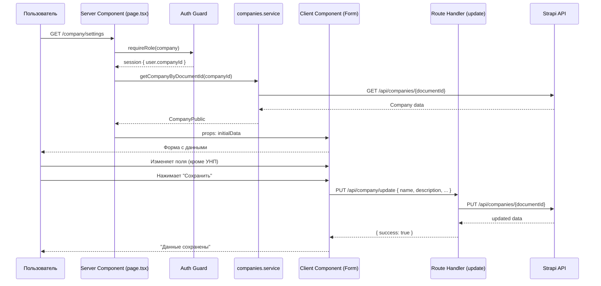

# План: Страница настроек компании (app/company/settings)

## Цель

Реализовать страницу просмотра и редактирования данных компании для авторизованных пользователей с ролью `company`. Поле УНП (ynp) отображается, но недоступно для изменения.

---

## Контекст

### Существующая архитектура

| Слой | Технология | Детали |
|------|-----------|--------|
| Auth | Better Auth | Сессия хранит `user.companyId` (documentId из Strapi) |
| БД (auth) | Drizzle ORM + PostgreSQL | Таблица `user` с полем `companyId` |
| CMS | Strapi 5 | Collection type `Company` с documentId |
| API-клиент | `lib/strapi-client.ts` | `fetchAPI<T>()` с read/write токенами |
| Сервис | `services/companies.service.ts` | `getCompanyByDocumentId()` для чтения |
| Роут (create) | `app/api/company/create/route.ts` | POST — создание компании + привязка к пользователю |
| UI | shadcn/ui + Tailwind | `SettingsForm` как референс (Client Component) |

### Схема Company (Strapi)

```typescript
interface StrapiCompanyRecord {
  documentId: string;
  name: string;           // required
  slug: string;           // uid from name
  description: string;    // richtext
  website: string | null;
  industry: enum;         // IT | Finance | ...
  size: enum;             // 1-10 | 11-50 | ...
  location: string;       // required
  ynp: string;            // required — НЕ РЕДАКТИРУЕМ
  founded_year: number | null;
  logo: Media | null;
  isActive: boolean;
}
```

### Поток данных (Sequence)



---

## Пошаговый план реализации

### Шаг 1: API-роут `app/api/company/update/route.ts`

**Метод**: PUT

**Логика**:
1. Проверить сессию (auth.api.getSession)
2. Проверить роль `company` и наличие `companyId`
3. Извлечь из тела только разрешённые поля (WHITELIST):
   - `name`, `description`, `website`, `industry`, `size`, `location`, `founded_year`
4. **Исключить** из тела: `ynp`, `slug`, `documentId`, `isActive`
5. Отправить PUT в Strapi: `fetchAPI(/companies/${companyId}, { method: 'PUT', body: { data: {...} } })`
6. При успехе — revalidateTag('companies')
7. Вернуть `{ success: true, company: { ... } }`

**Ошибки**:
- 401: не авторизован
- 403: не компания
- 404: companyId не найден
- 502: ошибка Strapi

### Шаг 2: Компонент `components/company/CompanySettingsForm.tsx`

**Тип**: Client Component (`"use client"`)

**Props**:
```typescript
interface CompanySettingsFormProps {
  company: CompanyPublic;  // из companies.service
}
```

**Поля формы**:

| Поле | Тип | Редактируемое | Примечание |
|------|-----|:---:|-----------|
| УНП (ynp) | `Input disabled` | Нет | read-only, серый фон |
| Название (name) | `Input` | Да | |
| Описание (description) | `Textarea` | Да | |
| Сайт (website) | `Input type=url` | Да | |
| Логотип (logo) | file input + preview | Да | загрузка через отдельный API |
| Отрасль (industry) | `Select` | Да | enum из StrapiSchema |
| Размер (size) | `Select` | Да | enum из StrapiSchema |
| Локация (location) | `Input` | Да | |
| Год основания (founded_year) | `Input type=number` | Да | min=1800, max=2030 |

**Состояния**:
- `loading: boolean` — отправка формы
- `error: string` — текст ошибки
- `success: string` — текст успеха
- Локальный state для каждого поля

**Отправка**:
```typescript
const res = await fetch('/api/company/update', {
  method: 'PUT',
  headers: { 'Content-Type': 'application/json' },
  body: JSON.stringify({ name, description, website, industry, size, location, founded_year }),
});
```

**Валидация** (клиентская):
- name: required, maxLength 200
- description: required
- location: required
- founded_year: 1800-2030, integer

### Шаг 3: Обновление `app/company/settings/page.tsx`

```typescript
// Server Component
import { requireRole } from '@/lib/auth-guard';
import { getCompanyByDocumentId } from '@/services/companies.service';
import { CompanySettingsForm } from '@/components/company/CompanySettingsForm';

export default async function CompanySettingsPage() {
  const session = await requireRole('company');
  const companyId = session.user.companyId;

  if (!companyId) {
    return (
      <DashboardLayout role="company">
        <div>Компания ещё не зарегистрирована. Данные проходят проверку.</div>
      </DashboardLayout>
    );
  }

  const company = await getCompanyByDocumentId(companyId);

  if (!company) {
    return (
      <DashboardLayout role="company">
        <div>Компания не найдена в системе.</div>
      </DashboardLayout>
    );
  }

  return (
    <DashboardLayout role="company">
      <CompanySettingsForm company={company} />
    </DashboardLayout>
  );
}
```

### Шаг 4: API-роут `app/api/company/upload-logo/route.ts` (опционально)

**Метод**: POST (multipart/form-data)

**Логика**:
1. Проверить сессию и companyId
2. Принять FormData с файлом
3. Отправить файл в Strapi media upload
4. Обновить поле `logo` у компании (relation)
5. Вернуть URL логотипа

*Примечание: можно реализовать позже, если логотип не является критичным для первого релиза.*

---

## Граничные случаи

| Сценарий | Поведение |
|----------|-----------|
| `companyId` отсутствует у пользователя | Показать сообщение "Компания не зарегистрирована" (как в DashboardLayout) |
| Company не найдена в Strapi | Показать сообщение "Компания не найдена" + кнопка "Создать компанию" |
| Ошибка сети при загрузке формы | Повторная попытка через сервер (Server Component — revalidate на каждый запрос) |
| Ошибка при сохранении (Strapi 500) | Показать ошибку в форме, данные не теряются |
| Конфликт: slug уже изменился | Strapi auto-generates slug из name, игнорируем в PUT |
| УНП в теле запроса (попытка подмены) | Сервер отфильтровывает `ynp` из whitelist — never trust the client |

---

## Кэширование

- `getCompanyByDocumentId` использует `next: { revalidate: 1, tags: ['companies'] }`
- После успешного PUT — `revalidateTag('companies')` через Next.js API
- Можно вызвать `revalidatePath('/company/settings')` для немедленного обновления UI

---

## Файлы, которые будут изменены/созданы

| Файл | Действие |
|------|----------|
| `app/api/company/update/route.ts` | **Создать** |
| `components/company/CompanySettingsForm.tsx` | **Создать** |
| `app/company/settings/page.tsx` | **Изменить** |
| `app/api/company/upload-logo/route.ts` | **Создать** (по желанию) |
