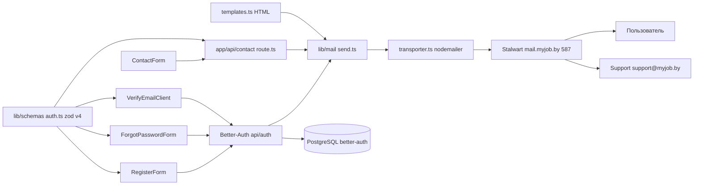

# Blueprint: Почтовый сервис MyJOB (Stalwart SMTP) + формы + zod-валидация

## 1. Цель

1. Подключить отправку транзакционных писем через почтовый сервер **Stalwart v0.16** (`mail.myjob.by`, порт 587 STARTTLS):
   - `no-reply@myjob.by` — письма пользователям (верификация email, восстановление пароля);
   - `support@myjob.by` — уведомления из контактной формы.
2. Включить flow восстановления пароля и верификации email на стороне Better-Auth.
3. Починить формы (контактная, регистрация, вход, восстановление) и перевести валидацию на **zod v4 + react-hook-form** (сейчас — ручные проверки через `useState`, zod не используется).

## 2. Ключевые решения

| Решение                     | Значение                                                                                                                         |
| --------------------------- | -------------------------------------------------------------------------------------------------------------------------------- |
| SMTP                        | `mail.myjob.by:587`, STARTTLS (`secure:false`, `requireTLS:true`), AUTH PLAIN                                                    |
| Sender (пользователям)      | `no-reply@myjob.by` (пароль `1704/int0408`)                                                                                      |
| Sender (контактная форма)   | `support@myjob.by` (пароль `1704/int0408`)                                                                                       |
| Получатель контактной формы | `support@myjob.by`, `Reply-To` = email отправителя                                                                               |
| baseURL / домен ссылок      | `https://myjob.by` (заменить устаревший `m.izrukvruki.by` в `lib/auth.ts`)                                                       |
| Верификация email           | Флаг `AUTH_REQUIRE_EMAIL_VERIFICATION` (default `true` = полный сценарий «проверьте почту»; `false` = вход сразу, письмо в фоне) |
| Библиотека почты            | `nodemailer` (+ `@types/nodemailer`)                                                                                             |
| Валидация                   | `zod@^4.4.3` + `@hookform/resolvers@^5.4.0` + `react-hook-form@^7.77.0` (уже установлены)                                        |

## 3. Архитектура



## 4. Файлы: создать

- `lib/mail/transporter.ts` — фабрика nodemailer-транспортера по identity (no-reply / support).
- `lib/mail/templates.ts` — HTML-шаблоны (inline styles, русский): verification, reset-password, contact-notification, contact-auto-reply.
- `lib/mail/send.ts` — обёртки `sendVerificationMail`, `sendResetPasswordMail`, `sendContactMail` + `sendMail` с try/catch и логированием.
- `lib/schemas/auth.ts` — zod v4 схемы: `registerSchema`, `loginSchema`, `forgotPasswordSchema`, `resetPasswordSchema`, `contactSchema`, `subscribeSchema`.
- `app/verify-email/page.tsx` + `components/auth/VerifyEmailClient.tsx` — подтверждение email (`authClient.verifyEmail`) + повторная отправка (`authClient.sendVerificationEmail`).
- `app/reset-password/page.tsx` + `components/auth/ResetPasswordForm.tsx` — сброс пароля (`authClient.resetPassword`), `token` из `searchParams` (Promise в Next.js 16, `await searchParams`).
- `app/api/contact/route.ts` — POST: `contactSchema.safeParseAsync`, отправка на `support@myjob.by`, ответ `{ ok: true }` / 400.
- `components/contacts/ContactForm.tsx` — Client Component (react-hook-form + zodResolver), заменяет инертную форму.
- `.env.example` — SMTP + auth переменные.

## 5. Файлы: изменить

- `lib/auth.ts` — добавить `baseURL`, актуальные `trustedOrigins`, `emailVerification.sendVerificationEmail`, `emailAndPassword.sendResetPassword` + `requireEmailVerification` из env-флага.
- `components/auth/RegisterForm.tsx` — react-hook-form + zod; после `signUp.email` при обязательной верификации показать экран «Проверьте почту» вместо редиректа; создание компании оставить в фоне.
- `components/auth/LoginForm.tsx` — react-hook-form + zod.
- `components/auth/ForgotPasswordForm.tsx` — убрать заглушку `setTimeout`, вызвать `authClient.requestPasswordReset({ email, redirectTo: "/auth/login" })`.
- `app/contacts/page.tsx` — вставить `<ContactForm />` в левую колонку (оставить Server Component).
- (Опционально) `components/jobs/subscribe-form.tsx` — перевести на `subscribeSchema`.

## 6. Переменные окружения

```dotenv
# Почта (SMTP Stalwart)
SMTP_HOST=mail.myjob.by
SMTP_PORT=587
SMTP_SECURE=false
SMTP_STARTTLS=true

# Отправители
SMTP_USER_NO_REPLY=no-reply@myjob.by
SMTP_PASS_NO_REPLY=1704/int0408
SMTP_USER_SUPPORT=support@myjob.by
SMTP_PASS_SUPPORT=1704/int0408
MAIL_TO_SUPPORT=support@myjob.by

# Приложение
APP_URL=https://myjob.by
AUTH_REQUIRE_EMAIL_VERIFICATION=false
```

## 7. Better-Auth: целевая конфигурация

```ts
emailAndPassword: {
  enabled: true,
  requireEmailVerification: process.env.AUTH_REQUIRE_EMAIL_VERIFICATION === "false",
  sendResetPassword: async ({ user, url }) => sendResetPasswordMail(user, url),
  resetPasswordTokenExpiresIn: 3600,
},
emailVerification: {
  sendOnSignUp: true,
  sendVerificationEmail: async ({ user, url }) => sendVerificationMail(user, url),
  autoSignInAfterVerification: true,
},
baseURL: process.env.APP_URL || "https://myjob.by",
trustedOrigins: [process.env.APP_URL || "https://myjob.by", "http://localhost:3000"],
```

`url` из Better-Auth содержит готовые ссылки: `https://myjob.by/verify-email?token=...` и `https://myjob.by/reset-password/<token>?callbackURL=...` — под них создаются страницы из п.4.

## 8. Zod-схемы (zod v4)

```ts
registerSchema = z
  .object({
    name: z.string().trim().min(2),
    email: z.string().trim().email(),
    password: z.string().min(8),
    confirmPassword: z.string(),
    role: z.enum(['user', 'company']),
    ynp: z.string().trim().optional(),
    consent: z.literal(true, { error: 'Необходимо согласие' }),
  })
  .refine((v) => v.password === v.confirmPassword, { path: ['confirmPassword'] })
  .refine((v) => v.role !== 'company' || (v.ynp && v.ynp.length > 0), { path: ['ynp'] });
```

## 9. Замечания и риски

- Next.js 16: `searchParams` в страницах — Promise, обязательно `await` (см. уже используемый паттерн в `app/api/strapi/[...path]/route.ts`).
- nodemailer импортируется только в серверных модулях (`lib/auth.ts`, route handlers) — не попадает в клиентский бандл.
- Пароли в `.env` — не коммитить; `.env.example` — только заглушки.
- Если `AUTH_REQUIRE_EMAIL_VERIFICATION=false`, страницы verify/reset остаются рабочими, но вход не блокируется до верификации.
- Контактная форма: ответить 200 даже при ошибке отправки SMTP не рекомендуется — вернуть 500 и показать «Не удалось отправить, попробуйте позже».
- Контактный email на странице (`contact@myJOB.by`) согласовать: рабочий получатель — `support@myjob.by`.

## 10. Порядок реализации

1. Зависимости + env.
2. Слой почты `lib/mail/*`.
3. Better-Auth `lib/auth.ts`.
4. Zod-схемы `lib/schemas/auth.ts`.
5. Страницы verify-email / reset-password.
6. Рефакторинг RegisterForm / LoginForm / ForgotPasswordForm.
7. Контактная форма (route + компонент + страница).
8. `pnpm lint`, `pnpm build`, ручной тест писем (verify/reset/contact).
