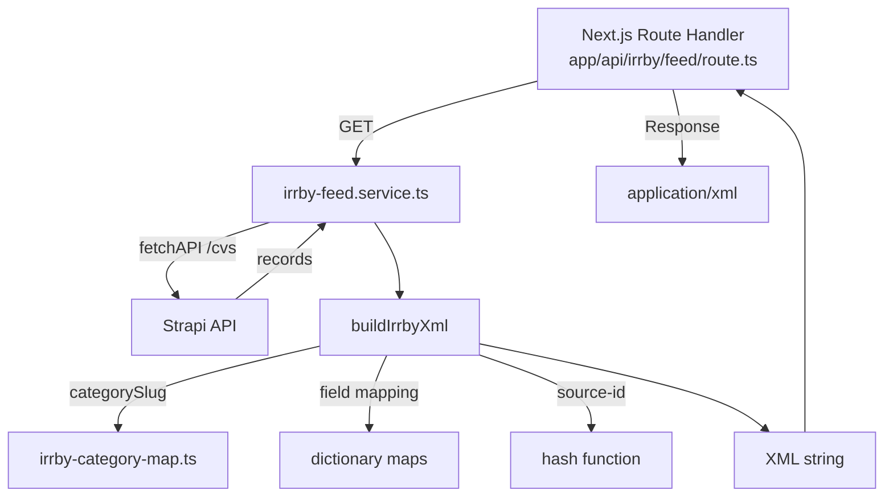

# План реализации XML фида IRR.BY

## 1. Общая архитектура



## 2. Файловая структура

```
services/
  irrby-feed.service.ts        -- основной сервис генерации
app/
  data/
    irrby-category-map.ts       -- маппинг категорий myjob -> IRR.BY рубрики
    irrby-dictionaries.ts       -- справочники dictionary: опыт, образование, пол, etc.
    belarus-cities.ts           -- справочник городов РБ -> область + областной центр
app/
  api/
    irrby/
      feed/
        route.ts                -- GET handler, отдаёт XML
```

## 3. Маппинг категорий (`app/data/irrby-category-map.ts`)

### Существующие категории myjob.by -> IRR.BY рубрики

| myjob.by slug             | myjob.by name           | IRR.BY rubric path                                 |
| ------------------------- | ----------------------- | -------------------------------------------------- |
| `it`                      | IT и цифровые профессии | `/classified/jobandeducation/vacancies/it/`        |
| `finance`                 | Финансы и бухгалтерия   | `/classified/jobandeducation/vacancies/bank/`      |
| `medicine`                | Медицина и сервис       | `/classified/jobandeducation/vacancies/medicine/`  |
| `logistics`               | Логистика и склад       | `/classified/jobandeducation/vacancies/logistics/` |
| `sales`                   | Продажи и клиенты       | `/classified/jobandeducation/vacancies/sales/`     |
| `marketing`               | Маркетинг и PR          | `/classified/jobandeducation/vacancies/marketing/` |
| `*` (любая другая / null) | --                      | `/classified/jobandeducation/vacancies/other/`     |

**Расширение**: Если появятся новые категории в myjob.by, маппинг расширяется добавлением записи в этот файл.

## 4. Маппинг custom fields (`services/irrby-feed.service.ts`)

### Правила маппинга для каждого поля:

| IRR.BY field            | Источник в Strapi CV                        | Тип маппинга                        | Default       |
| ----------------------- | ------------------------------------------- | ----------------------------------- | ------------- |
| `web`                   | `https://myjob.by/jobs/{slug}-{documentId}` | формируется из slug+docId           | --            |
| `phone`                 | `company.phone`                             | копируется как есть                 | --            |
| `sex`                   | --                                          | нет в схеме                         | `Любой`       |
| `metro`                 | --                                          | нет в схеме                         | не передавать |
| `geo_lat`               | --                                          | нет в схеме                         | не передавать |
| `geo_lng`               | --                                          | нет в схеме                         | не передавать |
| `geo_status`            | --                                          | нет в схеме                         | не передавать |
| `direction`             | --                                          | нет в схеме                         | не передавать |
| `shosse`                | --                                          | нет в схеме                         | не передавать |
| `distance`              | --                                          | нет в схеме                         | не передавать |
| `distance_km`           | --                                          | нет в схеме                         | не передавать |
| `address_region`        | `city` -> lookup в справочнике городов      | маппинг город -> область            | `Минская`     |
| `address_area`          | --                                          | нет в схеме                         | не передавать |
| `address_city`          | `city` -> lookup в справочнике городов      | маппинг город -> областной центр    | `Минск`       |
| `address_ao`            | --                                          | нет в схеме                         | не передавать |
| `address_district`      | --                                          | нет в схеме                         | не передавать |
| `address_microdistrict` | --                                          | нет в схеме                         | не передавать |
| `mapStreet`             | --                                          | нет в схеме                         | не передавать |
| `mapHouseNr`            | --                                          | нет в схеме                         | не передавать |
| `currency`              | `currency` (`BYN/USD/EUR`)                  | dictionary `cf_currency`            | `руб.`        |
| `age`                   | --                                          | нет в схеме                         | не передавать |
| `title`                 | `title`                                     | копируется                          | --            |
| `experience`            | `experience_job`                            | dictionary `cfd_irrby_experience`   | `любой`       |
| `price`                 | `salaryFrom`/`salaryTo`                     | форматируется как строка            | не передавать |
| `education`             | `education_job`                             | dictionary `cfd_irrby_education`    | `любое`       |
| `stud`                  | --                                          | нет в схеме                         | `нет`         |
| `view`                  | --                                          | нет в схеме                         | `любая`       |
| `employment`            | `employmentType`                            | dictionary `cfd_irrby_employment`   | `любая`       |
| `text`                  | `description`                               | копируется (richtext -> plain text) | --            |
| `workplace`             | --                                          | нет в схеме                         | `любое`       |
| `payment`               | --                                          | нет в схеме                         | `любая`       |

### Dictionary маппинги (`app/data/irrby-dictionaries.ts`):

#### `cfd_irrby_sex`

```
любой = Любой
муж = Муж
жен = Жен
```

#### `cf_currency`

```
BYN = руб.
USD = $
EUR = €
```

#### `cfd_irrby_experience`

```
любой = любой
нет опыта = нет опыта
до 1 года = до 1 года
более 1 года = более 1 года
более 3-х лет = более 3-х лет
более 5-ти лет = более 5-ти лет
```

#### `cfd_irrby_education`

```
любое = любое
MBA = MBA
Аспирантура = Аспирантура
Высшее = Высшее
Высшее техническое = Высшее техническое
Высшее экономическое = Высшее экономическое
Высшее юридическое = Высшее юридическое
Магистратура = Магистратура
Неоконч. высшее = Неоконч. высшее
Средне-специальное = Средне-специальное
Среднее = Среднее
Студент. Вечерняя форма обучения = ...
и т.д.
```

#### `cfd_irrby_stud`

```
нет = нет
да = да
```

#### `cfd_irrby_view`

```
любая = любая
постоянная = постоянная
временная = временная
сезонная = сезонная
волонтерство = волонтерство
практика = практика
стажировка = стажировка
```

#### `cfd_irrby_employment`

```
любая = любая
полная = полная
частичная = частичная
разовая работа = разовая работа
```

#### `cfd_irrby_place`

```
любое = любое
в помещении (на территории) работодателя = в помещении (на территории) работодателя
на дому у себя = на дому у себя
разъездная = разъездная
```

#### `cfd_irrby_payment`

```
любая = любая
почасовая = почасовая
сдельная = сдельная
```

## 5. XML структура

### Полный шаблон:

```xml
<?xml version="1.0" encoding="utf-8"?>
<users>
  <user deactivate-untouched="false">
    <match>
      <user-name>import:job minsk-irr</user-name>
    </match>
    <store-ad
      validfrom="2026-07-07T10:42:19"
      validtill="2026-07-13T10:42:19"
      source-id="90000123"
      category="/classified/jobandeducation/vacancies/it/"
    >
      <custom-fields>
        <field name="region">Минская</field>
        <field name="address_city">Минск</field>
        <field name="web">https://myjob.by/jobs/programmist-abc123</field>
        <field name="phone">+375(29) 111-22-33</field>
        <field name="contact">Название компании</field>
        <field name="sex">Любой</field>
        <field name="title">Программист</field>
        <field name="experience">более 3-х лет</field>
        <field name="price">от 2000</field>
        <field name="currency">руб.</field>
        <field name="education">Высшее</field>
        <field name="stud">нет</field>
        <field name="view">постоянная</field>
        <field name="employment">полная</field>
        <field name="text">Описание вакансии...</field>
        <field name="workplace">в помещении (на территории) работодателя</field>
        <field name="payment">любая</field>
      </custom-fields>
    </store-ad>
  </user>
</users>
```

### Параметры `store-ad`:

- `validfrom`: `createdAt` дата в ISO формате
- `validtill`: `datetime_finish` (или `deadline`) в ISO формате; если нет -- `createdAt + 30 дней`
- `source-id`: `90000 + hash(documentId)` (числовой, уникальный)
- `category`: маппинг из irrby-category-map.ts

### Обязательные поля в custom-fields:

- `region` (всегда передавать, default "Минская")
- `address_city` (всегда передавать, default "Минск")
- `web` (ссылка на вакансию)
- `contact` (название компании)
- `phone` (если есть)
- `title`
- `text` (описание)

## 6. Source-id генерация

```
hash = Array.from(documentId).reduce((acc, char) => acc + char.charCodeAt(0), 0)
source-id = 900000 + hash
```

где `documentId` — строковый идентификатор из Strapi.

Пример: `documentId = "abc123"`:

- `hash = 'a'(97) + 'b'(98) + 'c'(99) + '1'(49) + '2'(50) + '3'(51) = 444`
- `source-id = 900000 + 444 = 90444`

## 7. Route endpoint

**Файл**: [`app/api/irrby/feed/route.ts`](app/api/irrby/feed/route.ts)

- `GET` handlers
- `dynamic = "force-dynamic"`
- Content-Type: `application/xml; charset=utf-8`
- Кеширование: `no-cache` (на уровне route); данные кешируются на 45 мин внутри fetch через `next: { revalidate: 2700 }`
- Обработка ошибок: возврат XML `<error>` при сбое

## 8. Пошаговый план реализации

### Шаг 1: Data layer — справочники и маппинги

**Файлы**:

- [`app/data/irrby-category-map.ts`](app/data/irrby-category-map.ts)
- [`app/data/irrby-dictionaries.ts`](app/data/irrby-dictionaries.ts)
- [`app/data/belarus-cities.ts`](app/data/belarus-cities.ts)

Создать три файла:

1. Маппинг myjob category slug -> IRR.BY rubric path (с fallback на `/classified/jobandeducation/vacancies/other/`)
2. Все dictionary маппинги для custom fields (sex, currency, experience, education, stud, view, employment, workplace, payment)
3. Справочник городов РБ: city -> { region (область), regionalCenter (областной центр) }. Включает областные центры + крупные города (~20 записей). Для неизвестных городов fallback: region="Минская", regionalCenter="Минск"

### Шаг 2: Service — генерация XML

**Файл**: [`services/irrby-feed.service.ts`](services/irrby-feed.service.ts)

Создать сервис `generateIrrbyFeedXml()`:

1. Запросить все активные CV записи из Strapi с кешированием на 45 мин:
   ```
   /cvs?populate=*&filters[isActive][$eq]=true&pagination[pageSize]=500
   fetch options: { next: { revalidate: 2700, tags: ["irrby-feed"] } }
   ```
2. Для каждой записи:
   - Определить IRR.BY категорию через category map
   - Сгенерировать source-id (900000 + hash от documentId)
   - Смапить все custom fields с dictionary-значениями
   - Построить `<store-ad>` XML
3. Оборачивает в `<users>` конверт с `<user-name>import:job minsk-irr</user-name>`

### Шаг 3: Route handler

**Файл**: [`app/api/irrby/feed/route.ts`](app/api/irrby/feed/route.ts)

Создать GET handler, вызывающий `generateIrrbyFeedXml()` и возвращающий XML ответ.

### Шаг 4: Валидация

- Проверить валидность XML (нет пустых тегов, корректный escape)
- Проверить source-id на уникальность
- Проверить маппинг категорий для всех существующих CV записей

## 9. Ключевые технические решения

1. **Escape XML**: переиспользовать `escapeXml()` из yandex-feed сервиса (или вынести в отдельный хелпер)
2. **Richtext -> plain text**: для поля `text` (description) очищать HTML/richtext разметку через stripTags или `replace(/<[^>]*>/g, '')` + обрезать до 3000 символов
3. **Title**: обрезать до 250 символов, проверять что начинается с буквы или цифры
4. **Phone форматирование**: передавать как есть (пользователь указал `+375(29) 111-22-33` или `+375291112233`)
5. **Date формат**: `validfrom` и `validtill` в ISO 8601: `YYYY-MM-DDTHH:mm:ss`

## 10. Проверки перед deployment

- [ ] Все dictionary значения покрыты
- [ ] XML корректно парсится
- [ ] source-id уникальны
- [ ] Спецсимволы в title/description экранированы
- [ ] Нет пустых `field` тегов
- [ ] `region` и `address_city` всегда присутствуют
- [ ] `web` поле формируется корректно
