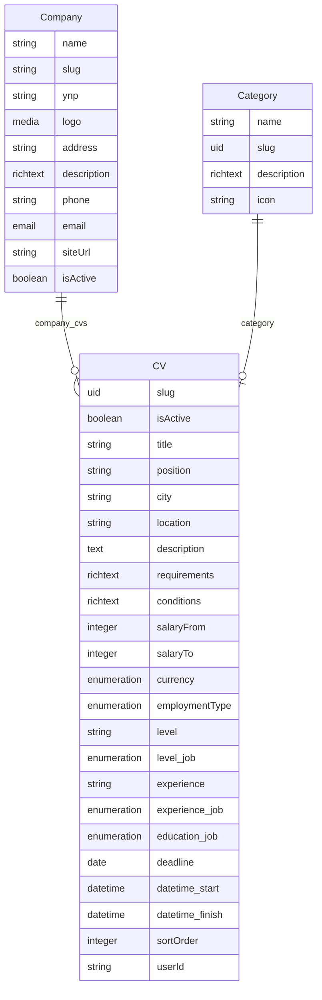

# План миграции: company-vacancy -> cv

## Контекст

Коллекция `company-vacancy` (endpoint: `/api/company-vacancies`) содержит вакансии компаний с встроенными полями компании (companyName, companyEmail, companyPhone, companyWebsite, companyDescription).

Новая коллекция `cv` (endpoint: `/api/cvs`) — это универсальная коллекция, которая через связи ссылается на:

- `company` (manyToOne -> `api::company.company`)
- `category` (oneToOne -> `api::category.category`)

## Новая схема данных

### CV (вакансия)

```typescript
// types/cv.ts

interface CvVacancy {
  id: string; // documentId
  documentId: string;
  slug: string;
  title: string;
  position: string; // желаемая должность
  description: string;
  requirements?: string;
  conditions?: string;
  salaryFrom?: number;
  salaryTo?: number;
  currency: 'BYN' | 'USD' | 'EUR';
  employmentType: CvEmploymentType; // русские названия
  location: string;
  city?: string;
  level_job?: CvLevelJob;
  experience_job?: CvExperienceJob;
  education_job?: CvEducationJob;
  deadline?: string;
  datetime_start?: string;
  datetime_finish?: string;
  sortOrder: number;
  isActive: boolean;
  userId: string;

  // Связанные коллекции (через populate)
  company: CompanyRef | null;
  category: CategoryRef | null;

  // Медиа и компоненты
  image?: any;
  SEO?: any[];
  Profile?: any[];

  // Мета
  createdAt: string;
  updatedAt: string;
  publishedAt?: string;
}

type CvEmploymentType =
  | 'Полная занятость'
  | 'Частичная занятость'
  | 'Проектная работа'
  | 'Стажировка'
  | 'Удаленно';

type CvLevelJob =
  | 'Топ-менеджмент'
  | 'Руководители среднего звена'
  | 'Специалисты'
  | 'Рабочий персонал'
  | 'Начинающие специалисты'
  | 'Стажеры';

type CvExperienceJob = 'Нет опыта' | 'От 1 года до 3 лет' | 'От 3 до 5 лет' | 'Более 5 лет';

type CvEducationJob =
  | 'Не требуется'
  | 'Базовое'
  | 'Среднее'
  | 'Средне специальное'
  | 'Профессионально-техническое'
  | 'Высшее';

interface CompanyRef {
  id: number;
  name: string;
  slug: string;
  logo?: { url: string; alternativeText?: string } | null;
  address?: string;
  description?: string;
  phone?: string;
  email?: string;
  siteUrl?: string;
  ynp?: string;
}

interface CategoryRef {
  id: number;
  name: string;
  slug: string;
  description?: string;
}
```

## Маппинг полей: Старый (company-vacancy) -> Новый (cv)

| Старое поле        | Новое поле          | Источник                                    |
| ------------------ | ------------------- | ------------------------------------------- |
| title              | title               | cv.title                                    |
| slug               | slug                | cv.slug                                     |
| companyName        | company.name        | cv.company -> company.name                  |
| companyEmail       | company.email       | cv.company -> company.email                 |
| companyPhone       | company.phone       | cv.company -> company.phone                 |
| companyWebsite     | company.siteUrl     | cv.company -> company.siteUrl               |
| companyDescription | company.description | cv.company -> company.description           |
| companyLogoUrl     | company.logo        | cv.company -> company.logo                  |
| position           | position            | cv.position                                 |
| description        | description         | cv.description                              |
| requirements       | requirements        | cv.requirements                             |
| conditions         | conditions          | cv.conditions                               |
| salaryFrom         | salaryFrom          | cv.salaryFrom                               |
| salaryTo           | salaryTo            | cv.salaryTo                                 |
| currency           | currency            | cv.currency                                 |
| employmentType     | employmentType      | cv.employmentType (теперь русские названия) |
| location           | location            | cv.location                                 |
| categorySlug       | category.slug       | cv.category -> category.slug                |
| categoryName       | category.name       | cv.category -> category.name                |
| level              | level_job           | cv.level_job (enum)                         |
| experience         | experience_job      | cv.experience_job (enum)                    |
| deadline           | deadline            | cv.deadline                                 |
| isActive           | isActive            | cv.isActive                                 |
| userId             | userId              | cv.userId                                   |

## Важные изменения

1. **employmentType**: теперь русские enum-значения вместо английских ключей
2. **level -> level_job**: используется структурированный enum
3. **experience -> experience_job**: используется структурированный enum
4. **Данные компании**: берутся из связанной коллекции, а не из полей вакансии
5. **Категория**: связь oneToOne, а не строковое поле

## Роутинг

Старый: `/company/vacancies/*`
Новый: `/company/cvs/*`

## План реализации

### Step 1: Типы CV

Файл: `types/cv.ts`

- `CvVacancy` — основной интерфейс
- `CvVacancyFormData` — данные формы
- `CvListResult` — результат списка с пагинацией
- `CvFilters` — фильтры
- `CompanyRef`, `CategoryRef` — ссылочные типы
- Enum-типы: `CvEmploymentType`, `CvLevelJob`, `CvExperienceJob`, `CvEducationJob`

### Step 2: Сервис CV

Файл: `services/cv.service.ts`

- CRUD операции с populate company и category
- Маппинг StrapiRecord -> CvVacancy
- Формирование payload для Strapi (с relation IDs)

### Step 3: CvForm

Файл: `components/vacancy/CvForm.tsx`

- Client Component
- Загрузка списка компаний из Strapi для select
- Загрузка списка категорий из Strapi для select
- Поля: title, position, description, requirements, conditions
- salaryFrom, salaryTo, currency
- employmentType (select с русскими названиями)
- location, city
- level_job (enum select)
- experience_job (enum select)
- education_job (enum select)
- deadline
- isActive

### Step 4: CvEditForm

Файл: `app/company/cvs/[id]/edit/CvEditForm.tsx`

- Аналогично CvForm, pre-filled

### Step 5: CvList

Файл: `app/company/dashboard/CvList.tsx`

- Client Component
- Загрузка списка CV по userId
- Отображение: title, company.name, position, salary
- Кнопки: edit (-> /company/cvs/[id]/edit), view (-> /jobs/[slug]), delete

### Step 6: Страницы (новый роутинг)

Создать:

- `app/company/cvs/new/page.tsx` — использует CvForm
- `app/company/cvs/[id]/edit/page.tsx` — Server Component, грузит Cv по documentId, рендерит CvEditForm
- `app/company/dashboard/page.tsx` — использует CvList

Удалить старые страницы:

- `app/company/vacancies/new/page.tsx`
- `app/company/vacancies/[id]/edit/page.tsx`
- `app/company/vacancies/[id]/edit/VacancyEditForm.tsx`

### Step 7: jobs.service.ts

- Обновить `StrapiCVRecord` под новую структуру с company relation и category relation
- Обновить `cvToJob()` — доставать company.name, company.slug и т.д. из связанной записи
- Обновить маппинг employmentType (с русских названий обратно на Job employmentType)

### Step 8: Миграция данных

На стороне Strapi нужно:

1. Создать компанию с нужными данными
2. Создать/обновить CV записи с ссылками на company и category
3. Перенести данные из company-vacancy в cv

### Step 9: Очистка

- Удалить `services/company-vacancy.service.ts`
- Удалить `types/company-vacancy.ts`
- Удалить `components/company/VacancyForm.tsx`
- Удалить `app/company/dashboard/VacancyList.tsx`
- Обновить `types/strapi-collections.ts` (убрать legacy CompanyVacancy типы)

### Step 10: Проверка совместимости

- `components/jobs/job-card.tsx`
- `components/jobs/job-details.tsx`
- `components/jobs/job-list.tsx`
- `app/jobs/[slug]/page.tsx`
- `app/jobs/page.tsx`

## Схема связей Strapi



## Strapi populate запрос

```typescript
const params = new URLSearchParams();
params.set('populate[company]', '*');
params.set('populate[category]', '*');
params.set('populate[image]', '*');
// /api/cvs?${params.toString()}
```
