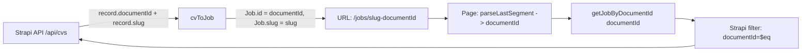

# План: Миграция URL вакансий с id на documentId

## Текущее состояние

URL вакансий: `/jobs/{slug}-{id}` где `id` — числовой `record.id` из Strapi (БД).

## Целевое состояние

URL вакансий: `/jobs/{slug}-{documentId}` где `documentId` — UUID строка из Strapi 5.

Например:
- Было: `/jobs/frontend-razrabotchik-42`
- Стало: `/jobs/frontend-razrabotchik-dh3jd8df`

## Обоснование

Strapi 5 вводит `documentId` как основной идентификатор для Document Service API. Числовой `id` привязан к строке БД и может меняться при миграциях/переносах между окружениями. `documentId` стабилен кросс-средово.

## Архитектура изменений

### Принцип: `Job.id` = `documentId`

В `Job` типе уже есть оба поля: `id: string` и `documentId: string`. После смены приоритета в `cvToJob()`, `Job.id` будет содержать `documentId` (UUID). Это делает все существующие конструкции `${job.slug}-${job.id}` корректными без изменений.

### Схема потока данных



## Изменения по файлам

### 1. `services/jobs.service.ts` — 2 изменения

**a) `cvToJob()` строка 205 — приоритет id:**

Сейчас:
```typescript
const id = String(record.id ?? record.documentId ?? record.slug ?? record.title);
```

Поменять на:
```typescript
const id = String(record.documentId ?? record.id ?? record.slug ?? record.title);
```

`Job.id` теперь будет содержать `documentId` (UUID строку).

**b) `getJobById()` строка 343 — переименовать и сменить фильтр:**

Сейчас:
```typescript
export async function getJobById(id: string | number) {
  // ...
  params.set('filters[id][$eq]', String(id));
```

Поменять на:
```typescript
export async function getJobByDocumentId(documentId: string) {
  if (!documentId) return null;
  try {
    const params = buildPopulateParams();
    params.set('filters[documentId][$eq]', documentId);
    // ...
```

Также нужно убрать `| number` из параметра, т.к. `documentId` всегда строка.

### 2. `app/jobs/[slug]/page.tsx` — обновить импорт

Строка 20:
```typescript
import { getJobById } from '@/services/jobs.service';
// → import { getJobByDocumentId } from '@/services/jobs.service';
```

Строки 72, 89:
```typescript
const job = await getJobById(id);
// → const job = await getJobByDocumentId(id);
```

Функция `parseSlugId()` остаётся без изменений — она извлекает последний сегмент, который теперь является `documentId`.

### 3. `app/company/dashboard/CvList.tsx` — исправить URL

Строка 189:
```typescript
href={`/jobs/${vacancy.slug}-${vacancy.strapiId || vacancy.id}`}
```

Поменять на:
```typescript
href={`/jobs/${vacancy.slug}-${vacancy.documentId}`}
```

`documentId` в `CvVacancy` уже есть (тип `types/cv.ts:59`).

### 4. Проверка (изменения не требуются)

Эти файлы уже используют `${job.slug}-${job.id}`, и после шага 1 `job.id` будет содержать `documentId`:

- `components/jobs/job-card.tsx:101` — `/jobs/${job.slug}-${job.id}` ✅
- `app/companies/[slug]/page.tsx:177` — `/jobs/${job.slug}-${job.id}` ✅

## Последовательность выполнения

| Шаг | Файл | Изменение |
|-----|------|-----------|
| 1 | `services/jobs.service.ts` | Приоритет `documentId` в `cvToJob()` + `getJobByDocumentId()` |
| 2 | `app/jobs/[slug]/page.tsx` | Импорт `getJobByDocumentId` |
| 3 | `app/company/dashboard/CvList.tsx` | URL на `documentId` |
| 4 | Проверка card + company | Без изменений (автоматически работают) |

## Проверки после миграции

1. Открыть `/jobs/{slug}-{documentId}` — страница вакансии загружается
2. Карточка вакансии на `/jobs` — ссылка ведёт на правильный URL
3. Страница компании — ссылки на вакансии корректны
4. Dashboard компании — ссылка "Просмотр" ведёт на правильный URL
5. `generateMetadata` работает корректно с новым форматом URL
