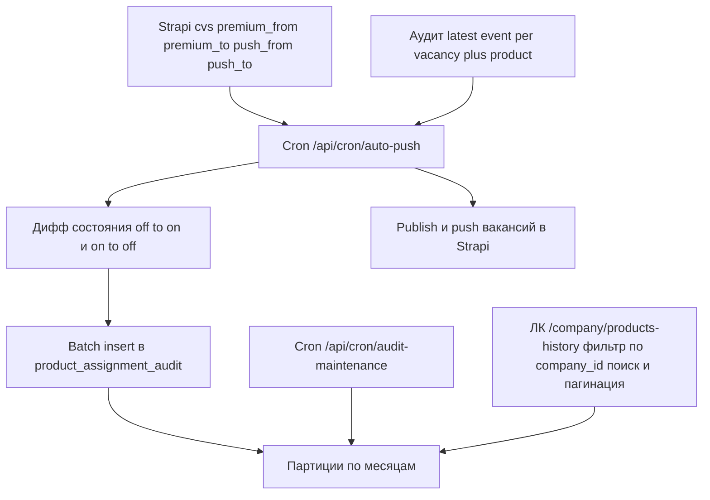

# Goal

Добавить append-only аудит-лог назначения продуктов (Премиум, Автоподнятие) в разрезе компаний и вакансий:

1. Таблица `product_assignment_audit` в БД приложения (Drizzle/Postgres) с месячным партиционированием по `created_at`, хранением 12 месяцев и удалением старых данных только через `DROP TABLE` партиций.
2. Запись событий `activated` / `deactivated` / `expired` в крон-задаче применения продуктов ([`app/api/cron/auto-push/route.ts`](app/api/cron/auto-push/route.ts:40)) до применения бизнес-изменений, без блокировки основного процесса.
3. Страница ЛК компании `/company/products-history` с пунктом сайдбара «История продуктов»: список вакансий компании (выборка из аудит-таблицы с фильтром по `company_id`), поиск по названию вакансии, пагинация, лог событий по каждому продукту.
4. Ежедневная крон-задача обслуживания партиций (создание будущих, удаление устаревших).

Подтверждённые с заказчиком решения:

- Таблица — в БД приложения (`DATABASE_URL`, Drizzle). JOIN с таблицами Strapi невозможен.
- `company_id` / `vacancy_id` — строковые `documentId` Strapi (не UUID). Собственный `id` записи — UUID.
- Название и slug вакансии денормализуются в аудит-таблицу (`vacancy_title`, `vacancy_slug`) для поиска, отображения и группировки без обращений к Strapi.
- Определение событий — Вариант A: без служебной state-таблицы. Крон сравнивает текущее состояние продуктов в Strapi с последней записью аудита по паре `vacancy_id + product_type`. `activated` = off → on, `deactivated` = on → off при непройденном `period_end`, `expired` = on → off при пройденном `period_end`.
- Бэкфилл не выполняется: история начинается с момента внедрения (для ранее назначенных продуктов первая запись появится только при следующем изменении состояния).
- ЛК: список вакансий фильтруется по `company_id` из сессии, применяется пагинация и поиск по `vacancy_title` (поиск сохраняется, требование 4.2).

# Current State

- Фронтенд: Next.js 16 (App Router), React 19, TypeScript strict, Drizzle ORM + `pg`.
- БД приложения: Postgres по `DATABASE_URL` ([`lib/db.ts`](lib/db.ts:4)), схема в [`lib/db/schema/`](lib/db/schema) (`auth.ts`, `notifications.ts`), миграции в [`lib/db/migrations/`](lib/db/migrations) (сгенерированы `drizzle-kit`, журнал `meta/_journal.json`, текущие версии 0000 и 0001).
- Контент (компании, вакансии `cvs`) — в Strapi 5. Идентификаторы — строковый `documentId`. У пользователя-компании `user.companyId` = `documentId` компании в Strapi ([`app/api/company/register/route.ts`](app/api/company/register/route.ts:192), [`lib/db/schema/auth.ts`](lib/db/schema/auth.ts:13)).
- Продукты хранятся как поля вакансии в Strapi: `premium_from`, `premium_to`, `push_from`, `push_to` ([`apps/backend/strapi-schema.ts`](apps/backend/strapi-schema.ts:794)); премиум-логика во фронтенде: [`services/cv.service.ts`](services/cv.service.ts:192), [`services/jobs.service.ts`](services/jobs.service.ts:294).
- Крон применения продуктов: [`app/api/cron/auto-push/route.ts`](app/api/cron/auto-push/route.ts:1) — автопубликация, автоснятие, автоподнятие через Strapi REST (`STRAPI_API_WRITE_TOKEN`), авторизация `Authorization: Bearer CRON_SECRET` либо `?secret=`. Запросы Strapi ограничены `pagination[pageSize]=100` без цикла по страницам, `populate` для компании не запрашивается.
- Второй крон для образца структуры и авторизации: [`app/api/cron/company-moderation/route.ts`](app/api/cron/company-moderation/route.ts:17).
- ЛК компании: [`app/company/dashboard/page.tsx`](app/company/dashboard/page.tsx:11) + [`components/dashboard/DashboardLayout.tsx`](components/dashboard/DashboardLayout.tsx:139) (пункты сайдбара, `hasCompany`), список вакансий — клиентский [`app/company/dashboard/CvList.tsx`](app/company/dashboard/CvList.tsx:32) с [`components/ui/pagination.tsx`](components/ui/pagination.tsx:13) (требует `onPageChange`, то есть клиентскую обёртку).
- Партиционирование в проекте не используется; Drizzle не умеет декларировать `PARTITION BY` — DDL партиционированной таблицы и партиции задаются вручную в сгенерированном SQL-миграционном файле.
- Переменных окружения для партиций не требуется; правила хранения — константы в коде.

# Proposed Solution

## 1. Схема БД

Новый файл [`lib/db/schema/product-audit.ts`](lib/db/schema/product-audit.ts):

- `pgEnum product_type` — `premium`, `auto_boost`.
- `pgEnum product_audit_event_type` — `activated`, `deactivated`, `expired`.
- Таблица `product_assignment_audit`:

| Колонка | Тип | Примечание |
|---|---|---|
| `id` | `uuid`, default `gen_random_uuid()` | часть составного PK |
| `company_id` | `text not null` | `documentId` компании Strapi |
| `vacancy_id` | `text not null` | `documentId` вакансии Strapi |
| `vacancy_title` | `text not null default ''` | денормализация для поиска и группировки |
| `vacancy_slug` | `text` | денормализация для ссылки на вакансию |
| `product_type` | `product_type not null` | |
| `event_type` | `product_audit_event_type not null` | |
| `period_start` | `timestamptz` | начало действия продукта |
| `period_end` | `timestamptz` | окончание действия продукта |
| `metadata` | `jsonb not null default '{}'` | источник, автор, идентификатор запуска крона |
| `created_at` | `timestamptz not null default now()` | ключ партиционирования |

- Первичный ключ — составной `PRIMARY KEY (id, created_at)` (требование Postgres для партиционированных таблиц).
- Индексы:
  - `(company_id, created_at DESC)` — основной путь выборки для ЛК;
  - `(company_id, vacancy_id, created_at DESC)` — фильтрация по вакансии;
  - `(vacancy_id, product_type, created_at DESC)` — обязателен для диффа состояния в кроне (`DISTINCT ON` по паре без сортировки);
  - GIN `pg_trgm` по `vacancy_title` — поиск в ЛК.
- Все временные метки — `timestamptz` (хранение в UTC); отличается от существующих таблиц (`timestamp`), отклонение осознанное по требованию 5.4.

## 2. Миграция и партиционирование

- `npx drizzle-kit generate` создаёт `lib/db/migrations/0002_*.sql` + `meta/0002_snapshot.json`.
- Сгенерированный SQL вручную дополняется:
  - `CREATE EXTENSION IF NOT EXISTS pg_trgm;`
  - в `CREATE TABLE "product_assignment_audit"` добавляется `PARTITION BY RANGE ("created_at")`;
  - после создания родительской таблицы и до создания индексов создаются партиции: `product_assignment_audit_YYYY_MM` на текущий месяц и 2 месяца вперёд (`FOR VALUES FROM ... TO ...` в UTC);
  - добавляется GIN-индекс по `vacancy_title gin_trgm_ops`.
- Порядок применения: `npx drizzle-kit migrate`. `drizzle-kit push` после внедрения партиций запрещён (пересоздаст таблицу без партиционирования).
- Новая утилита [`lib/db/partitions.ts`](lib/db/partitions.ts):
  - `partitionNameFor(date) => 'product_assignment_audit_YYYY_MM'`;
  - `ensureProductAuditPartitions(monthsAhead = 2)` — `CREATE TABLE IF NOT EXISTS ... PARTITION OF ...` для текущего и `monthsAhead` будущих месяцев;
  - `dropExpiredProductAuditPartitions(retentionMonths = 12)` — `DROP TABLE IF EXISTS` для партиций, у которых конец месяца `<= now - 12 месяцев`;
  - имена партиций валидируются регуляркой `^product_assignment_audit_\d{4}_\d{2}$` и подставляются через `sql.raw` (параметризовать идентификаторы нельзя);
  - список существующих партиций — `SELECT relname FROM pg_class WHERE relname LIKE 'product_assignment_audit_%'`;
  - функции идемпотентны, возвращают `{ created: string[], dropped: string[] }`.

## 3. Сервис аудита

Новый файл [`services/product-audit.service.ts`](services/product-audit.service.ts) + типы в [`types/product-audit.ts`](types/product-audit.ts):

- `insertProductAuditEvents(events: ProductAuditEventInput[])` — одна batch-вставка (drizzle `insert().values()`), обёрнута в try/catch: ошибка логируется и возвращается как `{ inserted, error }`, основного процесса не ломает (требование 5.2). Единственная функция записи; `update`/`delete` не экспортируются (append-only, требование 3.5).
- `getLatestAuditEventPerPair(vacancyIds?: string[])` — `SELECT DISTINCT ON (vacancy_id, product_type) ... ORDER BY vacancy_id, product_type, created_at DESC` через `sql` шаблон; используется кроном для диффа.
- `getCompanyProductHistory({ companyId, search?, page, pageSize })` — две выборки, без N+1:
  1. страница вакансий: `SELECT vacancy_id, max(vacancy_title) AS vacancy_title, max(vacancy_slug) AS vacancy_slug, max(created_at) AS last_event_at, count(*) FROM product_assignment_audit WHERE company_id = $1 [AND vacancy_title ILIKE '%' || $2 || '%'] GROUP BY vacancy_id ORDER BY last_event_at DESC LIMIT $3 OFFSET $4` + `SELECT count(DISTINCT vacancy_id) FROM product_assignment_audit WHERE company_id = $1 [AND vacancy_title ILIKE '%' || $2 || '%']` для `pageCount`;
  2. события по найденным `vacancy_id` (`WHERE company_id = $1 AND vacancy_id = ANY($2)`) с оконным ограничением `row_number() over (partition by vacancy_id, product_type order by created_at desc) <= 20`, чтобы ограничить размер ответа.
  - Результат — сгруппированная структура (требование 4.6):
    `{ items: [{ vacancyId, vacancyTitle, vacancySlug, products: { premium: Event[], auto_boost: Event[] } }], pagination: { page, pageSize, pageCount, total } }`.
- Подсчёт «Премиум с какой даты по какую» (требование 4.3) выполняется на стороне отображения из событий: последний `activated` определяет начало, `expired`/`deactivated` — окончание.

## 4. Запись событий в крон-задаче

Изменения в [`app/api/cron/auto-push/route.ts`](app/api/cron/auto-push/route.ts:40):

- Шаг 0 (выполняется до шагов 1–3, требование 3.4 — фиксация факта до бизнес-изменений):
  1. Взять advisory-lock `pg_try_advisory_lock(<const key>)`; при неудаче аудит в этом запуске пропускается (защита от дублирования при параллельных вызовах).
  2. Загрузить из Strapi активные продукты с постраничным циклом (helper `fetchAllCvsPages`, `pageSize=100`, пока `pagination.page < pageCount`), с `populate[company]=true` и `fields[0]=title&fields[1]=slug`:
     - премиум: `filters[premium_from][$lte]=now&filters[premium_to][$gte]=now`;
     - автоподнятие: `filters[push_from][$lte]=now&filters[push_to][$gte]=now`.
  3. Собрать `activePairs` (`vacancy_id + product_type`) с `period_start` / `period_end` / `vacancy_title` / `vacancy_slug` / `company_id`. Записи без `company.documentId` пропускаются с записью в `errors` (аудит без компании невозможен).
  4. Получить `openPairs` — пары, у которых последнее событие `activated` (нет закрывающего события).
  5. Дифф: `activePairs` без `openPairs` → `activated`; `openPairs` без `activePairs` → `expired` при `last.period_end <= now`, иначе `deactivated` (`period_end` берётся из последней записи аудита).
  6. `metadata` = `{ source: "cron", job: "auto-push", runAt: now, detectedBy: "state-diff" }`.
  7. `insertProductAuditEvents(events)` до шагов 1–3; при ошибке — запись в `errors`, продолжение работы крона.
  8. Освободить advisory-lock.
- Шаги 1–3 (publish / unpublish / push) остаются без изменения логики.
- Ответ роута дополняется полем `audit: { activated, deactivated, expired, errors? }`.

## 5. Крон обслуживания партиций

Новый роут [`app/api/cron/audit-maintenance/route.ts`](app/api/cron/audit-maintenance/route.ts) по образцу [`app/api/cron/company-moderation/route.ts`](app/api/cron/company-moderation/route.ts:17): авторизация `Authorization: Bearer CRON_SECRET` или `?secret=`, `GET`, вызов `ensureProductAuditPartitions()` и `dropExpiredProductAuditPartitions()`, ответ `{ ok, created, dropped, errors? }`. Расписание на сервере (внешний crontab): ежедневно, например `0 3 * * *`.

## 6. ЛК компании

- Новая страница [`app/company/products-history/page.tsx`](app/company/products-history/page.tsx) — Server Component, `metadata`, `searchParams: Promise<{ q?: string; page?: string }>` (Next 16 — параметры асинхронные), `getServerSession()` для `companyId`; при отсутствии `companyId` — сообщение «Компания не зарегистрирована»; вывод внутри `DashboardLayout role="company"`.
- Данные: `getCompanyProductHistory({ companyId, search: q, page, pageSize })` — фильтр строго по `company_id` компании из сессии (изоляция компаний), сортировка `created_at DESC`, пагинация в SQL.
- Клиентские части:
  - поисковая строка: обновляет `?q=` (сбрасывает `page`), состояние — в URL (конвенция проекта);
  - пагинация — тонкая обёртка над [`components/ui/pagination.tsx`](components/ui/pagination.tsx:13) с `onPageChange` → `router.push` с обновлённым `?page=`.
- Список — карточки по вакансиям (переиспользовать `Card`/`Badge`/`Input`/`EmptyState` из [`components/dashboard/EmptyState.tsx`](components/dashboard/EmptyState.tsx)): название вакансии, ссылка на вакансию `/jobs/{slug}-{documentId}` (если есть `vacancy_slug`), периоды Премиум и Автоподнятие, хронологический лог событий (бейдж типа события + метка времени + период).
- Отображение дат — в локальном времени `Europe/Minsk` через `toLocaleString('ru-RU', { timeZone: 'Europe/Minsk' })`; хранение — UTC.
- Пункт сайдбара в [`components/dashboard/DashboardLayout.tsx`](components/dashboard/DashboardLayout.tsx:139): `{ name: 'История продуктов', href: '/company/products-history', icon: History }` внутри блока `hasCompany`.

## Схема потока данных

# File Changes

- `create`: `lib/db/schema/product-audit.ts`
- `create`: `lib/db/migrations/0002_*.sql` (сгенерирован, затем вручную дополнен партиционированием, партициями и `pg_trgm`)
- `create`: `lib/db/migrations/meta/0002_snapshot.json` (генерируется drizzle-kit)
- `create`: `lib/db/partitions.ts`
- `create`: `services/product-audit.service.ts`
- `create`: `types/product-audit.ts`
- `create`: `app/api/cron/audit-maintenance/route.ts`
- `create`: `app/company/products-history/page.tsx`
- `create`: `components/company/product-history-list.tsx` (карточки вакансий и лог событий)
- `create`: `components/company/product-history-controls.tsx` (поиск и клиентская обёртка пагинации через URL-параметры)
- `modify`: `app/api/cron/auto-push/route.ts`
- `modify`: `components/dashboard/DashboardLayout.tsx`
- `modify`: `memory-bank/techContext.md` (описание таблицы, кронов, расписания и требований к `pg_trgm`)

# Implementation Steps

### Phase 1: Preparation & Infrastructure

- [ ] Создать [`lib/db/schema/product-audit.ts`](lib/db/schema/product-audit.ts): `pgEnum product_type`, `pgEnum product_audit_event_type`, таблица `product_assignment_audit` с колонками из раздела 1, составной `primaryKey(id, created_at)` и тремя btree-индексами.
- [ ] Сгенерировать миграцию `npx drizzle-kit generate` и вручную дополнить SQL: `CREATE EXTENSION IF NOT EXISTS pg_trgm`, `PARTITION BY RANGE ("created_at")`, партиции на текущий + 2 месяца, GIN-индекс `vacancy_title gin_trgm_ops`.
- [ ] Применить миграцию `npx drizzle-kit migrate` и проверить в `psql`: `relkind = 'p'`, наличие партиций, трёх btree-индексов и GIN-индекса.
- [ ] Создать [`lib/db/partitions.ts`](lib/db/partitions.ts) с `partitionNameFor`, `ensureProductAuditPartitions`, `dropExpiredProductAuditPartitions` (идемпотентно, валидация имён, `sql.raw`).

### Phase 2: Core Logic & Implementation

- [ ] Создать [`types/product-audit.ts`](types/product-audit.ts): `ProductType`, `ProductAuditEventType`, `ProductAuditEventInput`, `ProductAuditEvent`, `ProductHistoryVacancyGroup`, `CompanyProductHistoryResult`.
- [ ] Создать [`services/product-audit.service.ts`](services/product-audit.service.ts): `insertProductAuditEvents` (batch, fail-soft, без update/delete), `getLatestAuditEventPerPair`, `getCompanyProductHistory` (фильтр по `company_id`, поиск по `vacancy_title`, пагинация, две выборки, группировка по продуктам, окно 20 событий).
- [ ] Создать [`app/api/cron/audit-maintenance/route.ts`](app/api/cron/audit-maintenance/route.ts) с авторизацией по `CRON_SECRET` и вызовом обеих функций обслуживания партиций.

### Phase 3: Integration & UI/API Binding

- [ ] В [`app/api/cron/auto-push/route.ts`](app/api/cron/auto-push/route.ts:40) добавить helper постраничной загрузки Strapi (`populate[company]`, `fields[0]=title`, `fields[1]=slug`).
- [ ] Добавить шаг 0: сбор `activePairs` по премиуму и автоподнятию, получение `openPairs`, расчёт диффа, batch-вставка событий до шагов 1–3, advisory-lock, fail-soft логирование.
- [ ] Дополнить ответ роута полем `audit` и включить служебные ошибки аудита в общий массив `errors`.
- [ ] Создать [`app/company/products-history/page.tsx`](app/company/products-history/page.tsx): чтение `searchParams` (`q`, `page`), получение `companyId` из сессии, вызов `getCompanyProductHistory`, рендер внутри `DashboardLayout`, пустые состояния.
- [ ] Создать [`components/company/product-history-list.tsx`](components/company/product-history-list.tsx): карточки вакансий, периоды Премиум / Автоподнятие, хронологический лог событий.
- [ ] Создать [`components/company/product-history-controls.tsx`](components/company/product-history-controls.tsx): поисковая строка (`?q=`) и обёртка над `Pagination` с переходом по `?page=`.
- [ ] Добавить пункт «История продуктов» в `companyNavItems` в [`components/dashboard/DashboardLayout.tsx`](components/dashboard/DashboardLayout.tsx:139).

### Phase 4: Validation & Cleanup

- [ ] `pnpm typecheck` и `pnpm lint` без ошибок.
- [ ] Локальная проверка кронов (dev-сервер, `?secret=...`): запуск `audit-maintenance` → создание будущих партиций, повторный запуск идемпотентен.
- [ ] Локальная проверка аудита: ручной вызов `/api/cron/auto-push` дважды подряд → новые события появляются только при фактическом изменении состояния в Strapi.
- [ ] Обновить [`memory-bank/techContext.md`](memory-bank/techContext.md): таблица, партиционирование и retention, два крона, расписание в crontab, требование `pg_trgm`.

# Verification & Tests

- Схема: `psql` → `\d+ product_assignment_audit` (партиционированная таблица), `\d+ product_assignment_audit_YYYY_MM` (партиции), в списке индексов `(company_id, created_at DESC)`, `(company_id, vacancy_id, created_at DESC)`, `(vacancy_id, product_type, created_at DESC)` и GIN по `vacancy_title`.
- Идемпотентность: два последовательных вызова `/api/cron/auto-push` без изменений в Strapi → `audit.activated = 0`, число строк в таблице не меняется.
- Активация: выставить вакансии `premium_from = now - 1h`, `premium_to = now + 7d` → вызов крона → одна запись `activated` с заполненными `period_start`/`period_end` и `metadata.job = "auto-push"`.
- Истечение: сдвинуть `premium_to` в прошлое → вызов крона → одна запись `expired`, `period_end` равен значению из предыдущего события.
- Досрочное снятие: обнулить `premium_to` → запись `deactivated`.
- Автоподнятие: активный `push_from`/`push_to` при первом запуске после внедрения не создаёт `activated` (бэкфилл отключён); после смены периода создаётся событие.
- Отказоустойчивость: временно остановить БД → крон по-прежнему публикует и поднимает вакансии, в ответе есть запись об ошибке аудита (требования 3.4/5.2).
- Retention: вручную создать партицию устаревшего месяца с тестовой строкой → вызов `/api/cron/audit-maintenance` → партиция удалена, актуальные данные на месте.
- ЛК: под компанией с историей открыть `/company/products-history`; проверить группировку по вакансиям, поиск `?q=` (регистронезависимый, частичное совпадение), пагинацию `?page=`, сохранение параметров в URL; проверить изоляцию — данные другой компании не отображаются (подставить чужой `companyId` в ручном запросе сервиса — пустой результат).
- Производительность: `EXPLAIN ANALYZE` выборки истории компании — использование `paa_company_created_idx` без Seq Scan по родительской таблице при небольшом объёме; при поиске — Bitmap Index Scan по GIN.

# Acceptance Criteria

- [ ] Таблица `product_assignment_audit` создана как партиционированная по `created_at` с месячными партициями; PK включает `created_at`.
- [ ] Существуют индексы `(company_id, created_at DESC)`, `(company_id, vacancy_id, created_at DESC)`, `(vacancy_id, product_type, created_at DESC)` и GIN `pg_trgm` по `vacancy_title`.
- [ ] `company_id` и `vacancy_id` — строковые `documentId`; `id` записи — UUID; `period_start`, `period_end`, `created_at` — `timestamptz` (UTC).
- [ ] Крон `/api/cron/auto-push` пишет события `activated` / `deactivated` / `expired` до применения изменений, при этом публикация и поднятие вакансий продолжают работать при сбое записи аудита.
- [ ] Повторные запуски крона без изменения состояния в Strapi не создают дублирующих событий.
- [ ] `/api/cron/audit-maintenance` создаёт будущие партиции и удаляет партиции старше 12 месяцев; удаление выполняется только через `DROP TABLE` партиции.
- [ ] В ЛК компании есть страница `/company/products-history` с пунктом сайдбара «История продуктов».
- [ ] Список вакансий на странице фильтруется по `company_id` из аудита, поддерживает поиск по названию вакансии и пагинацию с состоянием в URL (`?q=`, `?page=`).
- [ ] Для каждой вакансии отображаются периоды Премиум и Автоподнятие и хронологический лог событий (сортировка по `created_at DESC`).
- [ ] Данные ЛК отдаются сгруппированными по вакансии и типу продукта; компании видят только свои записи.
- [ ] `pnpm typecheck` и `pnpm lint` проходят без ошибок.

# Risks & Edge Cases

- `CREATE EXTENSION pg_trgm` может быть недоступно пользователю БД: при ошибке применить расширение от суперпользователя вручную; функциональный фолбэк — `ILIKE` без индекса (работает корректно, но медленнее на больших объёмах).
- Drizzle не поддерживает `PARTITION BY`: DDL формируется вручную. После внедрения запрещён `drizzle-kit push` (пересоздание таблицы без партиционирования); изменение схемы — только через `generate` + правку SQL.
- Денормализация `vacancy_title`/`vacancy_slug`: переименование вакансии в Strapi не обновляет старые записи. В ЛК отображается название из последней записи по вакансии, то есть актуальное на момент последнего события.
- Дифф «последнее событие по паре» ежедневно читает до 12 месяцев индекса: при больших объёмах возможна деградация. Митигация — индекс `(vacancy_id, product_type, created_at DESC)` и `DISTINCT ON` по нему; при росте объёмов перейти на Вариант B со служебной state-таблицей.
- Отсутствует бэкфилл: продукты, назначенные до внедрения и не изменившие состояние, в истории не появятся — зафиксировано заказчиком.
- Пропуск события при простое крона: если продукт начался и закончился между запусками, будет записан только `activated` при следующем запуске (или `expired` при следующем сравнении открытой пары). Восстановление пропущенных интервалов не предусмотрено.
- Параллельные запуски крона (PM2 cluster, повторные curl) могут создать дубли — защита через `pg_try_advisory_lock`.
- Записи без `company.documentId` в Strapi (осиротевшие вакансии) не попадают в аудит: событие теряется, ошибка логируется в ответе крона.
- Вакансии, у которых никогда не было продуктов, на странице истории не отображаются — это следствие выбора источника данных (аудит-таблица).
- Изменение Strapi-схемы не требуется; поля `premium_*`/`push_*` и логика выдачи премиума не затрагиваются.

# Relevant Skills & Rules

- Проектные правила: [`AGENTS.md`](AGENTS.md) (русский язык, без эмодзи, kebab-case/PascalCase/camelCase, серверные компоненты по умолчанию, состояние страницы в URL-параметрах, доступ к API только через `lib/`/`services/`).
- Next.js 16: перед правкой API читать локальную документацию `node_modules/next/dist/docs/` (асинхронные `searchParams` в Server Components, Route Handlers).
- [`skills/next-js-react.md`](skills/next-js-react.md) — App Router, Server/Client Components, границы `"use client"`.
- [`skills/shadcn-ui.md`](skills/shadcn-ui.md) — переиспользовать существующие примитивы из `components/ui/` (`Card`, `Badge`, `Button`, `Input`, `Pagination`, `EmptyState`).
- [`skills/api-integration.md`](skills/api-integration.md) — типизированные ответы, коды ошибок, отсутствие `fetch` в визуальных компонентах.
- Порядок и стиль миграций — как в [`lib/db/migrations/`](lib/db/migrations) (drizzle-kit, `meta/_journal.json`).
- Образец крон-роута и авторизации — [`app/api/cron/company-moderation/route.ts`](app/api/cron/company-moderation/route.ts:17).

# Implementation Result

## Completed

- [x] Схема `product_assignment_audit`: pgEnum `product_type` / `product_audit_event_type`, timestamptz-колонки, составной PK `(id, created_at)`, три btree-индекса.
- [x] Миграция `0002_product_assignment_audit.sql`: `PARTITION BY RANGE (created_at)`, партиции на текущий и 2 месяца вперёд, `pg_trgm` и GIN-индекс по `vacancy_title`.
- [x] Миграция применена к БД приложения, партиционирование и индексы проверены.
- [x] [`lib/db/partitions.ts`](lib/db/partitions.ts): создание и удаление партиций, список партиций.
- [x] [`types/product-audit.ts`](types/product-audit.ts): типы событий, входных данных и ответов.
- [x] [`services/product-audit.service.ts`](services/product-audit.service.ts): batch-вставка, последнее событие по паре, история компании с поиском и пагинацией.
- [x] [`app/api/cron/audit-maintenance/route.ts`](app/api/cron/audit-maintenance/route.ts): ежедневное обслуживание партиций.
- [x] Шаг аудита в [`app/api/cron/auto-push/route.ts`](app/api/cron/auto-push/route.ts:245): дифф состояния, batch-вставка до бизнес-изменений, advisory-lock, fail-soft.
- [x] Страница [`app/company/products-history/page.tsx`](app/company/products-history/page.tsx:17), компоненты [`product-history-list.tsx`](components/company/product-history-list.tsx:1) и [`product-history-controls.tsx`](components/company/product-history-controls.tsx:1).
- [x] Пункт сайдбара «История продуктов» в [`DashboardLayout.tsx`](components/dashboard/DashboardLayout.tsx:139).
- [x] Документация в [`memory-bank/techContext.md`](memory-bank/techContext.md) и переменная `PRODUCT_AUDIT_TRACKING_SINCE` в [`.env.example`](.env.example:20).

## Modified Files

- `create`: lib/db/schema/product-audit.ts
- `create`: lib/db/migrations/0002_product_assignment_audit.sql
- `create`: lib/db/migrations/meta/0002_snapshot.json
- `create`: lib/db/partitions.ts
- `create`: types/product-audit.ts
- `create`: services/product-audit.service.ts
- `create`: app/api/cron/audit-maintenance/route.ts
- `create`: app/company/products-history/page.tsx
- `create`: components/company/product-history-list.tsx
- `create`: components/company/product-history-controls.tsx
- `modify`: app/api/cron/auto-push/route.ts
- `modify`: components/dashboard/DashboardLayout.tsx
- `modify`: memory-bank/techContext.md
- `modify`: .env.example
- `modify`: lib/db/migrations/meta/_journal.json

## Validation

- `npx drizzle-kit generate --name=product_assignment_audit` — passed
- `npx eslint <изменённые файлы>` — passed
- `npx tsc --noEmit` — passed
- Применение миграции 0002 в БД (10.0.15.201/job) — passed: parent `relkind = p`, партиции `product_assignment_audit_2026_09/2026_10/2026_11`, индексы `paa_company_created_idx`, `paa_company_vacancy_created_idx`, `paa_vacancy_product_created_idx`, `paa_vacancy_title_trgm_idx`
- Вставка через родительскую таблицу — направлена в `product_assignment_audit_2026_09` (тестовая строка откачена)
- Сервисы (временный tsx-скрипт): вставка 2 событий, `getLatestAuditEventPerPair` (ISO UTC), `getCompanyProductHistory` — группировка по продуктам, пагинация, поиск «Тестовая» = 1, заведомо отсутствующий запрос = 0, изоляция компании = 0; тестовые строки удалены
- Партиции: `ensureProductAuditPartitions` идемпотентен, устаревшая партиция `2024_01` удалена вместе со строкой при вызове `dropExpiredProductAuditPartitions`

## Deviations

- `npx drizzle-kit migrate` неприменим: в БД проекта журнал `drizzle.__drizzle_migrations` пуст (схема велась через push и better-auth CLI), поэтому migrate пытается повторно применить миграции 0000/0001. Миграция 0002 применена напрямую тем же SQL в транзакции; архитектурные решения не менялись.
- Отсутствие бэкфилла реализовано явным порогом `PRODUCT_AUDIT_TRACKING_SINCE` (по умолчанию `2026-09-22T00:00:00.000Z`): продукты с `period_start` раньше порога не создают событие `activated`.
- Timestamps в raw-выборках приведены к ISO-8601 UTC через `to_char(... AT TIME ZONE 'UTC')`, так как `db.execute` возвращает `timestamptz` строкой с часовым поясом сервера; массивы передаются через `sql.join` вместо `ANY($1)`.
- Крон `/api/cron/auto-push` в реальной среде не запускался (он изменяет реальные вакансии в Strapi) — требуется ручная проверка на стенде.
