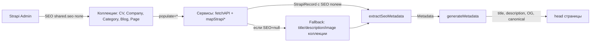

# SEO-компонент для Strapi 5 + Next.js 15

## Статус (подтверждено)

- Компоненты `shared.seo` и `shared.open-graph` **уже созданы** в Strapi
- Поле `SEO` (тип component `shared.seo`) **уже добавлено** во все коллекции: CV, Company, Category, Blog, Page
- SEO компонент **опциональный** — если данных нет, используются fallback-данные из самой коллекции
- На **Page** поле `meta_description` **заменяется** на SEO-компонент
- Для populate используется **`populate=*`** (уже стоит в blog.service, для остальных — переключить на `populate=*`)

---

## Шаг 1: Фронтенд — типы SEO

Создать файл [`types/seo.ts`](types/seo.ts) с интерфейсами:

```typescript
export interface OpenGraph {
  ogTitle: string;
  ogDescription: string;
  ogImage?: StrapiMedia | null;
  ogUrl?: string;
  ogType?: string;
  id?: number;
}

export interface SeoMetadata {
  id?: number;
  metaTitle: string;
  metaDescription: string;
  metaImage?: StrapiMedia | null;
  openGraph?: OpenGraph | null;
  keywords?: string | null;
  metaRobots?: string | null;
  metaViewport?: string | null;
  canonicalURL?: string | null;
  structuredData?: Record<string, unknown> | null;
}

export interface StrapiMedia {
  id: number;
  url: string;
  alternativeText?: string | null;
  width?: number;
  height?: number;
  formats?: Record<string, { url: string; width: number; height: number }>;
}

export type WithSeo<T> = T & { SEO?: SeoMetadata | null };
```

---

## Шаг 2: Фронтенд — утилита extractSeoMetadata

Создать [`lib/extract-seo.ts`](lib/extract-seo.ts):

- Принимает `SEO` объект + fallback-заголовок/описание/изображение
- Формирует Next.js `Metadata` с OpenGraph
- Если `SEO` = null — использует fallback-данные (title коллекции, excerpt/description и т.д.)
- Разрешает URL изображений через `getStrapiMediaURL`
- Обрабатывает `structuredData` (JSON-LD) через `metadata.other`

```typescript
import { getStrapiMediaURL } from '@/lib/strapi-client';
import type { Metadata } from 'next';
import type { SeoMetadata, OpenGraph } from '@/types/seo';

export interface SeoInput {
  SEO?: SeoMetadata | null;
  fallbackTitle?: string;
  fallbackDescription?: string;
  fallbackImage?: string;
  siteName?: string;
}

export function extractSeoMetadata(input: SeoInput): Metadata { ... }
```

---

## Шаг 3: Фронтенд — обновление сервисов (populate=*)

Почти все сервисы уже используют `populate=*`. Проверить:

| Сервис | populate | Статус |
|--------|----------|--------|
| `services/blog.service.ts` | `populate=*` | уже есть |
| `services/jobs.service.ts` | точечный `buildPopulateParams()` | **заменить** на `populate=*` |
| `services/cv.service.ts` | точечный `buildPopulateParams()` | **заменить** на `populate=*` |
| `services/companies.service.ts` | `populate[logo]=true` | **заменить** на `populate=*` |
| `services/categories.service.ts` | `populate=*` | уже есть |
| `services/pages.service.ts` | `populate=blocks` | **заменить** на `populate=*` |

> **Важно:** При замене на `populate=*` убедиться, что logo/company/category/image все еще подтягиваются. `populate=*` — это populate всех relations на 1 уровень, чего достаточно.

В мапперах сервисов добавить проброс `SEO` поля в выходной тип.

---

## Шаг 4: Фронтенд — обновление типов коллекций

Добавить опциональное поле `SEO` в:

| Тип | Файл | Поле |
|-----|------|------|
| `BlogArticle` | [`types/blog.ts`](types/blog.ts) | `SEO?: SeoMetadata \| null` |
| `CvVacancy` | [`types/cv.ts`](types/cv.ts) | заменить `SEO?: unknown[]` на `SEO?: SeoMetadata \| null` |
| `Job` | [`types/jobs.ts`](types/jobs.ts) | `SEO?: SeoMetadata \| null` |
| `CompanyPublic` | [`services/companies.service.ts`](services/companies.service.ts) | `SEO?: SeoMetadata \| null` |
| `Page` | [`types/strapi-collections.ts`](types/strapi-collections.ts) | `SEO?: SeoMetadata \| null` (удалить `meta_description`) |

---

## Шаг 5: Фронтенд — обновление страниц (generateMetadata)

Каждую страницу перевести на `extractSeoMetadata`:

| Страница | Fallback title | Fallback description | Fallback image |
|----------|---------------|---------------------|----------------|
| [`app/blog/[slug]/page.tsx`](app/blog/[slug]/page.tsx) | `article.title` | `article.excerpt` | `article.coverUrl` |
| [`app/jobs/[slug]/page.tsx`](app/jobs/[slug]/page.tsx) | `job.title` | `job.description` | `job.image` |
| [`app/companies/[slug]/page.tsx`](app/companies/[slug]/page.tsx) | `company.name` | `company.description` | `company.logoUrl` |
| [`app/categories/[category]/page.tsx`](app/categories/[category]/page.tsx) | `categoryName` | `Вакансии в категории {name}` | — |
| [`app/(content)/about/page.tsx`](app/(content)/about/page.tsx) | `page.title` | `page.SEO.metaDescription` | — |
| (аналогично help, pricing, privacy, terms) | | | |

---

## Диаграмма потока данных



---

## Список файлов для изменения

| Файл | Действие |
|------|----------|
| `types/seo.ts` | **Создать** |
| `lib/extract-seo.ts` | **Создать** |
| `types/blog.ts` | **Обновить** — добавить SEO |
| `types/cv.ts` | **Обновить** — заменить SEO?: unknown[] |
| `types/jobs.ts` | **Обновить** — добавить SEO в Job |
| `types/strapi-collections.ts` | **Обновить** — SEO в Page, удалить meta_description |
| `services/jobs.service.ts` | **Обновить** — populate=*, проброс SEO |
| `services/cv.service.ts` | **Обновить** — populate=*, проброс SEO |
| `services/companies.service.ts` | **Обновить** — populate=*, SEO в CompanyPublic |
| `services/pages.service.ts` | **Обновить** — populate=*, SEO в mapPage |
| `app/blog/[slug]/page.tsx` | **Обновить** — generateMetadata |
| `app/jobs/[slug]/page.tsx` | **Обновить** — generateMetadata |
| `app/companies/[slug]/page.tsx` | **Обновить** — generateMetadata |
| `app/categories/[category]/page.tsx` | **Обновить** — generateMetadata |
| `app/(content)/about/page.tsx` | **Обновить** — generateMetadata |
| `app/(content)/help/page.tsx` | **Обновить** — generateMetadata |
| `app/(content)/pricing/page.tsx` | **Обновить** — generateMetadata |
| `app/(content)/privacy/page.tsx` | **Обновить** — generateMetadata |
| `app/(content)/terms/page.tsx` | **Обновить** — generateMetadata |
