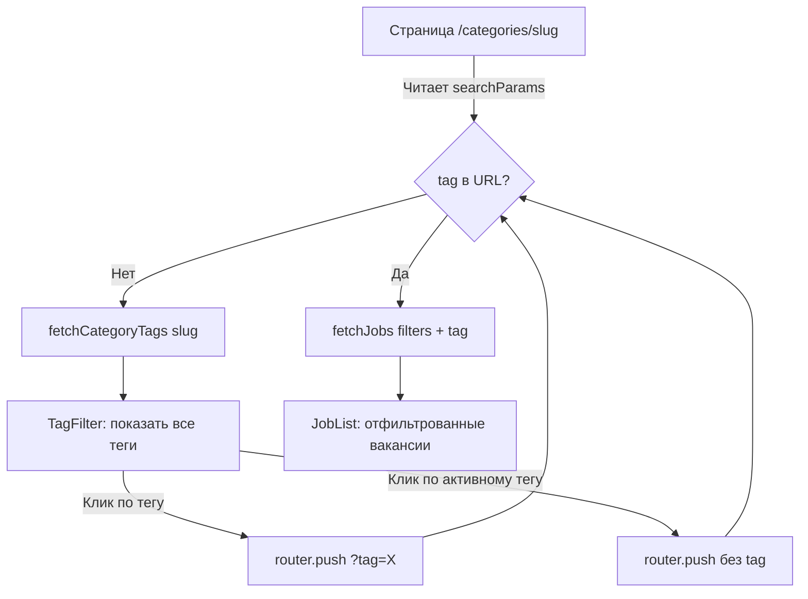

# План: Добавление тегов (tags) к CV и фильтрация на странице категории

## Описание задачи

1. Временно установить `revalidate: 60` для всех запросов к Strapi (сейчас `revalidate: 1`)
2. Добавить поле `tags` (массив строк/JSON) в коллекцию CV (Strapi)
3. На странице категории (`/categories/[slug]`) агрегировать уникальные теги из всех CV данной категории и отобразить их как кликабельные блоки
4. При клике на тег — добавлять `?tag=...` в URL и фильтровать CV по этому тегу

## Замечание по роутингу

В запросе указан путь `/jobs/[slug]`, однако в текущей кодовой базе:
- `/jobs/[slug]` — это страница **детального просмотра** одной вакансии
- `/categories/[category]` — это страница **категории** со списком вакансий

План реализован для `/categories/[category]`, т.к. это фактическая страница категории.

---

## Milestone 1: Временный revalidate = 60

Заменить `revalidate: 1` на `revalidate: 60` в следующих сервисах:

| Файл | Количество вхождений | Строки |
|---|---|---|
| `services/jobs.service.ts` | 6 | 403, 482, 504, 525, 555, 593 |
| `services/cv.service.ts` | 3 | 187, 204, 403 |
| `services/resume.service.ts` | 2 | 165, 183 |
| `services/companies.service.ts` | 3 | 89, 111, 129 |
| `services/categories.service.ts` | 1 | 110 |

**Не трогать:**
- `services/professions.service.ts` — использует переменную `REVALIDATE_SECONDS = 1800` (уже > 60)
- `services/blog.service.ts` — использует `cache: "no-store"`
- `services/pages.service.ts` — уже `revalidate: 60`
- `services/cities.service.ts` — уже `revalidate: 14400`
- Sitemap/фиды — используют `revalidate: 3600` (долгий кеш — ок)

---

## Milestone 2: Поле `tags` в Strapi (схема)

**Плагин:** Использовать **Tags Input** custom field plugin (`strapi-plugin-tags-input`).
Этот плагин предоставляет UI для ввода массива строк, хранит данные как JSON-массив.

**Установка плагина в Strapi:**
```bash
cd apps/backend && npm install strapi-plugin-tags-input
```
Затем пересобрать админку: `npm run build` (в папке Strapi).

**Создание поля в Strapi Admin Panel:**
1. Зайти в Strapi Admin -> Content-Type Builder -> CV
2. Добавить новое поле: выбрать **Tags Input** из списка custom fields
3. API Name: `tags`
4. Сохранить

**Файл:** `apps/backend/strapi-schema.ts` (раздел CVSchema, после `push_to`)

Добавить атрибут:

```typescript
tags: {
  type: 'json',
  required: false,
  default: [],
}
```

Поле `tags` — JSON-массив строк (например `["JavaScript", "React", "Node.js"]`).

---

## Milestone 3: TypeScript типы

### 3.1. `types/cv.ts` — `CvVacancy`
Добавить: `tags?: string[]`

### 3.2. `services/cv.service.ts` — `StrapiCvRecord`
Добавить: `tags?: string[]`

### 3.3. `services/cv.service.ts` — `mapStrapiCv()`
Добавить маппинг: `tags: (record.tags as string[]) || []`

### 3.4. `services/jobs.service.ts` — `StrapiCVRecord`
Добавить: `tags?: string[]`

### 3.5. `services/jobs.service.ts` — `cvToJob()`
Добавить маппинг: `tags: record.tags || []`

### 3.6. `types/strapi-collections.ts` — `Job` interface
Добавить: `tags?: string[]`

---

## Milestone 4: Фильтрация по тегу в jobs.service.ts

### 4.1. `types/strapi-collections.ts` — `JobFilters`
Добавить: `tag?: string`

### 4.2. `services/jobs.service.ts` — `buildFiltersParams()`
Добавить фильтр по тегу в Strapi:

```typescript
if (filters.tag) {
  params.set('filters[tags][$contains]', filters.tag);
}
```

Это работает, потому что Strapi 5 поддерживает `$contains` для JSON-массивов — проверяет, содержит ли массив указанную строку.

### 4.3. `services/jobs.service.ts` — `getPremiumJobs()`
Добавить аналогичный фильтр для премиум-выборки.

---

## Milestone 5: Компонент `TagFilter` (Client Component)

**Файл:** `components/jobs/tag-filter.tsx`

Требования:
- Принимает: `tags: string[]` (все уникальные теги), `activeTag: string | null`, `basePath: string`
- Клиентский компонент (`'use client'`)
- Использует `useSearchParams()` и `useRouter()` для чтения/установки `?tag=...`
- Отображает теги как кликабельные блоки (Badge / button)
- Активный тег визуально выделен
- При клике на активный тег — убирает `?tag` из URL
- При клике на неактивный тег — устанавливает `?tag=значение`
- Сохраняет остальные searchParams (чтобы не сбрасывать фильтры)

```tsx
'use client';

interface TagFilterProps {
  tags: string[];
  basePath: string;
}
```

---

## Milestone 6: Функция агрегации тегов

**Файл:** `services/jobs.service.ts` (новая функция)

```typescript
export async function getCategoryTags(categorySlug: string): Promise<string[]> {
  // 1. Fetch ALL CVs for this category (без пагинации, все активные)
  // 2. Extract unique tags from all CVs
  // 3. Return sorted unique tags array
}
```

Важно: функция должна игнорировать `tag` фильтр (показывать все теги всегда).

---

## Milestone 7: Обновление страницы категории

**Файл:** `app/categories/[category]/page.tsx`

Изменения:
1. Добавить `tag` в типизацию `searchParams`
2. Создать `JobFilters` с полем `tag`
3. Добавить параллельный вызов `getCategoryTags(category)` рядом с существующими запросами
4. Рендерить `TagFilter` компонент над `<JobList>`

Псевдокод:

```tsx
const tags = await getCategoryTags(category);
const filters: JobFilters = {
  ...existingFilters,
  tag: sp.tag || '',
};

// В JSX:
<TagFilter tags={tags} basePath={`/categories/${category}`} />
<JobList filters={filters} ... />
```

---

## Milestone 8: Обновление `JobList` (передача tag фильтра)

**Файл:** `components/jobs/job-list.tsx`

`JobFilters` уже включает `tag` (добавлено в Milestone 4), поэтому `JobList` автоматически передаст его в `getJobs()`. Никаких изменений в `JobList` не требуется, если фильтр корректно передаётся через `filters`.

Проверить: в `buildFiltersParams` фильтр `tag` уже учтён.

---

## Диаграмма потока данных



## Strapi API запросы

### Фильтрация по категории + тегу

```
GET /api/cvs?populate=*&filters[isActive][$eq]=true&filters[category][slug][$eq]=it&filters[tags][$contains]=JavaScript&sort[0]=publishedAt:desc&pagination[page]=1&pagination[pageSize]=6
```

### Агрегация всех тегов категории

```
GET /api/cvs?fields[0]=tags&filters[isActive][$eq]=true&filters[category][slug][$eq]=it&pagination[pageSize]=100
```

---

## Порядок выполнения (рекомендуемый)

1. **Milestone 1** — revalidate 60 (простая diff-операция)
2. **Milestone 2** — добавить поле tags в Strapi
3. **Milestone 3** — обновить типы и мапперы
4. **Milestone 4** — добавить фильтр tag в buildFiltersParams
5. **Milestone 6** — создать функцию getCategoryTags
6. **Milestone 5** — создать компонент TagFilter
7. **Milestone 7** — обновить страницу категории
8. **Milestone 8** — проверить JobList
